# OPS-SCHEMA — Phase 1: lược đồ đích theo Phiếu v1.4

Ngày: **01/10/2026** · Agent thực thi: **Codex** · Nhánh: **docs/db-schema-review**.
Trạng thái: **khảo sát tĩnh và đề xuất để review; không phải quyết định triển khai**.

## 1. Kết luận và giới hạn

**17 bảng hiện tại chưa phủ đủ Phiếu v1.4.** Phần thiếu chủ yếu là phiên video đồng bộ GPS/lux,
quan sát qua từng lượt, baseline có phiên bản, kết quả ON/OFF và căn cứ kiểm chứng; kế tiếp là
telemetry/lệnh, bằng chứng, hàng chờ QR và đồng bộ offline. Không có căn cứ xoá bảng hiện hữu nào.
Không cần đợi dựng hết lược đồ cuối mới chép DB lên Supabase: những bảng chưa có dữ liệu có thể thêm
sau. Cần chốt **dữ liệu nào được mang sang và ý nghĩa của dữ liệu tạm** trước khi chép, đặc biệt FX-1,
định danh tài sản và provenance; không đánh đồng việc chép đúng bytes với dữ liệu nghiệp vụ đúng.

- **CHẮC** = có căn cứ trực tiếp trong Phiếu, Contract, quyết định được task chỉ định hoặc code.
  Không có nghĩa Codex được quyền sửa API/schema. Cấu trúc mới vẫn phải đi qua Phase 1 của ticket sở hữu.
- **KHÔNG CHẮC** = chưa chốt cách biểu diễn, mâu thuẫn ngữ nghĩa hoặc cần thử nghiệm/ý kiến nhóm.
  Các tên/cột mới dưới đây là **đề xuất**, không phải API/entity đã tồn tại; không tự cấp prefix mới.
- Phiếu v1.4 là nguồn chuẩn **phạm vi** theo lệnh giao việc. Contract vẫn là nguồn chuẩn **bề mặt
  đã công bố**. Chỗ Phiếu đổi nền được nêu như việc cần quyết, không coi là quyền sửa Contract ngầm.
- D-R21/D-R24 và các WO/FR/R/I chạm API vẫn có cảnh báo nền tạm/FW như nguồn. BE-15 trên nhánh khác
  tự ghi `draft`, “flow đề xuất”, có chín câu hỏi mở: dùng các ràng buộc đã nêu, không nâng tất cả
  chi tiết trong flow thành đặc tả đã ký. EV-1/EV-2 và FX-1 chỉ đăng ký, **chưa chốt**.
- Chỉ viết file kết quả này. Theo điểm dừng riêng của task, không cập nhật dashboard/log quyết định,
  không sửa mã/Contract/mock/CSV, không commit/push. Những nhận xét dưới đây chưa phải quyết định
  mới có hiệu lực liên nhóm; người review chuyển các mục được duyệt về đúng tầng sau này.

## 2. Nguồn, phiên bản và bằng chứng đọc thật

Ký hiệu dùng trong báo cáo:

| Ký hiệu | Nguồn và cách tham chiếu |
|---|---|
| **P:n** | `docs/registration/FA26SE222_v1.4.md`, dòng n; đã đọc toàn bộ 351 dòng |
| **C:§n** | `docs/api-contract-v1.1.md`, bản hợp nhất v1.7, mục n |
| **D:mã** | `docs/contract-drift.md`, mã quyết định; D-R19…28 ở dòng 109–153; WO ở 405–485; FR ở 488–507; I ở 509–564; P ở 591–616; R ở 618–648 |
| **S:n** | `src/LuxMap.Persistence/Migrations/LuxMapDbContextModelSnapshot.cs`, dòng n |
| **B:n** | `docs/BE-15-survey-flow:.ai/tasks/BE-15.md`, dòng n (đọc bằng `git show`) |
| **EV:n** | `docs/BE-15-survey-flow:docs/contract-drift.md`, dòng 651–669 |
| **FX:n** | `feat/photos-to-poles:docs/contract-drift.md`, dòng 651–664 |
| **U:n** | `chore/supabase-deploy:.ai/results/OPS-SUPABASE-p1.md`, dòng n |

Đã đọc `AGENTS.md` (symlink), `.ai/README.md`, `.ai/context/sources.md`, task OPS-SCHEMA,
`.ai/context/commands.md`, CSV và các phần tiến độ liên quan trong `tracking.html`.
`current.md` còn ghi OPS-SUPABASE/chore/supabase-deploy; lệnh giao việc hiện tại chỉ định rõ OPS-SCHEMA,
nhánh thực tế đúng, nên không sửa con trỏ cũ. Không thao tác các file untracked có sẵn.

Output terminal trong phiên này:

```text
$ git branch --show-current
docs/db-schema-review
$ git rev-parse HEAD docs/BE-15-survey-flow feat/photos-to-poles chore/supabase-deploy
7d877cf93216b27cca00b434c4f5fe54b71ef134
5b3ef783ceb1eb22e09d04be2c70f91d27a5eb2f
438113181f123fc71b8c7976a7f85998d09906da
0607f784a58db75cc15aaa543b245a8f45f7c1b7
```

Đếm tĩnh bằng Python (`re.findall(r'b.ToTable\("', snapshot)`, đếm `.HasForeignKey(`,
annotation `LuxMap:CommuneScopeApplied`, `modelBuilder.HasSequence`), output thật:

```text
snapshot_tables = 17
snapshot_foreign_keys = 42
snapshot_commune_scope_annotations = 13
snapshot_display_sequences = 11
tables = feeder, fixture, pole, pole_current_status, road_segment, fault, fault_cluster, app_user, app_user_commune, refresh_token, lux_reading, feeder_control, iot_node, work_order, work_order_fault, administrative_unit, audit_event
```

17 là bảng ứng dụng trong **snapshot**, không tính bảng lịch sử EF/PostGIS/hạ tầng.
Không dùng con số “18 bảng owner deploytest” trong U:364 để kết luận có thêm domain entity.

**Bằng chứng DB kế thừa, không phải tôi kết nối DB:** lệnh
`git show chore/supabase-deploy:.ai/results/OPS-SUPABASE-p1.md` trả phần Claude đo 01/10 (U:329–346):

```text
pole / fixture      | 217 | in_keep 217 | outside_keep 0
road_segment        | 20  | in_keep 20  | outside_keep 0
fault 28 · fault_cluster 1 · feeder 3 · feeder_control 3 · iot_node 3 · work_order 3 · work_order_fault 11
 audit_event 0 · lux_reading 0 · pole_current_status 0
pole by commune/data_source: COM-001 field 36 · COM-002 field 78 · COM-070 public_imagery 103
users_total 18 | seed_users 4 | outside_seed 14
tham chiếu tới user ngoài seed: 0 rows · audit theo actor: 0 rows · cột trong xã giữ trên tuyến xã khác: 0 rows
```

U:353–358 ghi Mỹ **đã chốt D-1…D-7**, không còn là bảy câu hỏi đang chờ như đầu báo cáo đó:
phương án A, migrate rồi chép có lọc; ba xã/bốn user seed; giữ high-water sequence; bỏ refresh token;
workspace vận hành riêng; đóng ghi. U:360–414 là diễn tập local và các hạn chế còn lại, **không chứng
minh Supabase thật đã triển khai**. Không lặp lại triển khai trong OPS-SCHEMA.
“Bảng nghiệp vụ sạch” ở U:350 nghĩa là sạch rác test theo kiểm kê đó; **không phủ nhận FX-1** về
thông số bóng tạm, cũng không chứng minh mọi feeder đã xác minh thực địa. Số đo có thể đổi sau mốc đo.

## 3. Kiểm kê 17 bảng hiện tại

Quy ước: **R** = `ON DELETE RESTRICT`, **C** = Cascade. “Scope” là thật sự implement
`ICommuneScoped` và có annotation cấu hình, không suy ra chỉ vì có cột xã. Tất cả FK `commune_id`
trong bảng dưới đều về `administrative_unit`, R. Dấu `?` là nullable.
Các dòng enum text có CHECK; ID hiển thị dùng sequence + `luxmap_format_id`, không UUID client.

| Bảng; bằng chứng snapshot | PK / unique đáng chú ý | FK khác và hành vi xoá | Scope / data_source / IAudited |
|---|---|---|---|
| `administrative_unit` S:1307–1348 | `commune_id`; unique `name`, `seed_key?` | Không FK; không geometry | Không (mốc neo); không DS; không audit marker |
| `app_user` S:668–744 | `user_id`; unique username/email | Không FK; role text CHECK 4 vai trò | Không; không DS; không marker |
| `app_user_commune` S:748–770 | `(user_id, commune_id)` | user C, commune R | Có cột xã nhưng **không** interface; bảng cấp quyền, không tài nguyên bị scope; không DS/marker |
| `refresh_token` S:773–850 | bigint identity `id`; unique token_hash; index chain/expiry | user C; `replaced_by_token_id?` tự tham chiếu R | Không; không DS/marker; token chỉ hash |
| `road_segment` S:336–410 | `segment_id`; unique partial `(commune_id,external_ref)` khi ref khác null | commune R | Có; có DS; không marker |
| `feeder` S:49–107 | `feeder_id`; AK `(feeder_id,commune_id)`; external_ref partial như tuyến | commune R | Có; **không DS**; không marker |
| `pole` S:199–278 | `pole_id`; external_ref partial | segment R (cho phép khác xã); `(feeder_id?,commune_id)` → AK feeder R | Có; có DS; không marker |
| `fixture` S:112–193 | `fixture_id`; unique partial `pole_id WHERE removed_date IS NULL` | pole C; commune R | Có; có DS; không marker |
| `pole_current_status` S:284–330 | `pole_id` vừa PK vừa FK, tối đa 1/cột | pole C; **last_sweep_id chưa FK** | Có; không DS; không marker |
| `fault_cluster` S:621–663 | `cluster_id` | segment R, commune R | Có; không DS; không marker |
| `fault` S:416–615 | `fault_id`; AK `(fault_id,commune_id)`; unique partial client_op_id; xmin | pole?, fixture?, segment?, cluster?, reported_by?, confirmed_by?, resolved_by? đều R | Có; có DS; **có marker** |
| `lux_reading` S:854–933 | `lux_id`; unique client_op_id; index `(pole_id,measured_at)` | pole, measured_by đều R | Có; có DS; không marker |
| `iot_node` S:995–1066 | `node_id`; AK `(node_id,commune_id)` | commune R; **không FK pole/segment** | Có; DS chỉ `calibration_rig/simulated`; không marker |
| `feeder_control` S:939–990 | `feeder_id`; unique `(node_id,relay_no)` | `(feeder_id,commune_id)` và `(node_id,commune_id)` đều R | Có; không DS; không marker |
| `work_order` S:1072–1242 | `work_order_id`; AK `(work_order_id,commune_id)`; xmin | assigned_to?, created_by, segment?, cluster? R; parent/root? FK ghép cùng xã R | Có + `IAssigneeScoped`; không DS; **có marker** |
| `work_order_fault` S:1248–1301 | `(work_order_id,fault_id)`; unique fault_id khi released_at null | FK ghép WO/xã và fault/xã, R | Có (không assignee); không DS; **có marker** |
| `audit_event` S:1351–1444 | bigint identity ALWAYS `audit_id`; index `(entity_type,entity_id,audit_id)` | actor_user_id? R; entity_id **không FK đa hình** | Có; không DS; không IAudited (tránh audit đệ quy); append-only |

Cấu hình FK đầy đủ ở S:1450–1793. Các interface đối chiếu trong `src/LuxMap.Modules.*/Entities/*.cs`,
`src/LuxMap.Persistence/AdministrativeUnit.cs`, `src/LuxMap.Persistence/Audit/AuditEvent.cs`.
GIST có ở pole/node Point 4326, road_segment LineString 4326 và feeder LineString 4326 nullable.
Không ép geometry feeder thành NOT NULL: P:175 cho phép thiếu topology, không được bịa đường cáp.

Các ràng buộc thực tế quan trọng:

- `pole_current_status` **đã** có `ck_pole_current_status_confidence_range` (S:328), hữu hạn 0..1;
  `confidence_matches_status` bắt null iff unknown (S:326). Đoạn “đang hở” cũ trong AGENTS/tracking
  là lịch sử chưa dọn, không đề xuất “vá thiếu CHECK” lần nữa.
- `lux_value` không âm và loại NaN/+Infinity (S:933); âm vô cực bị chặn bởi không âm.
  fault có CHECK confidence, toạ độ hữu hạn trong miền, priority hữu hạn nhưng **không có trần 100**.
- `fixture` chỉ LED/grid; `lamp_watt:int` và `install_date:date` NOT NULL, warranty nullable;
  removed_date không trước install_date. Không có cột “đã xác minh thông số”. Đây là nền FX-1.
- `feeder_control` relay >0, mode `on/off/auto?` null đồng thời mode_reported_at. Mode do thiết bị
  báo, **không phải** ý định của Quản lý. `node_status` tính lúc đọc, không lưu.
- WO đã có inspection/repair, lịch, báo cáo, materials_note/materials_used, chuỗi parent/root;
  root NULL ở lịch đầu. Không có `survey`, ExternalUnit, evidence. WO không lưu priority_score:
  service đọc max từ sự cố; không tạo cột này chỉ vì DTO có nó.
- Audit chỉ nhận entity_type `work_order/fault`, actor `user/cv/iot`, action hiện hữu
  (S:1430–1444). `AuditWriteGuard.cs:10–25` đòi **một event cho một SaveChanges có thay đổi audited**,
  không phải một event/entity. `LuxMapDbContext.cs` gọi audit guard trước guard xã.
  Trigger SQL nằm ở `Migrations/20260927161055_AddAuditEvent.cs:76–96`, không thể thấy đầy đủ trong
  snapshot: chặn UPDATE/DELETE/TRUNCATE, ngoại lệ purge test đã có. Đây không phải chống sửa bởi SQL owner.
- BE-11 chỉ cung cấp `IObjectStore`, `StorageKeys`, `StoredImage`, `ImagePipeline` cho JPEG;
  **không** có bảng SurveyFrame/RepairEvidence trong 17 bảng. Không gộp hai luồng vì chung adapter.
- Không có telemetry, sweep, frame, detection, baseline, luminance_history, notification, bảng sync.
  Tên trong Contract/domain list hoặc task CSV **không phải bằng chứng hiện thực**.

## 4. Đối chiếu Phiếu v1.4 → lược đồ

“Mức” ở đây đánh giá kết luận có/thiếu; cách dựng bảng cụ thể nằm ở mục 5, có phần KHÔNG CHẮC.

| Chức năng / căn cứ | Đang có | Thiếu, cần sửa hoặc không cần thêm bảng | Mức |
|---|---|---|---|
| Superior: xem mạng, tình trạng, fault; xuất phân tích/bảo trì P:73–75 | GIS, fault, WO, quyền theo tập xã | Chuỗi điều kiện và telemetry thiếu; BE-28…31 làm query/export. Không suy ra phải có bảng report | CHẮC |
| Manager: xem GIS, quản lý cột/bóng/tuyến P:83–85 | pole/fixture/segment/feeder + CRUD | FX-1 cần biểu diễn đúng loại và dữ liệu chưa biết; tủ điện độc lập xem D-S17 | CHẮC thiếu ngữ nghĩa; cấu trúc KHÔNG CHẮC |
| Manager: lịch sử bảo trì P:87 | fixture qua lần thay; fault/WO/WOF/audit | Evidence chưa có; không cần FaultHistory thứ hai | CHẮC |
| Manager: giao tuyến khảo sát P:89 | WO có lịch/người giao, chưa task_kind survey | Tuyến có thứ tự + profile + liên kết nhiều lần nộp phiên; FR-1/B:88–89,128–131 | CHẮC nhu cầu; KHÔNG CHẮC hình dạng |
| Manager: review phiên/kết quả P:91 | Chưa có bảng | Phân biệt xử lý kỹ thuật, review và công bố; lưu lý do trả về | CHẮC |
| Manager: xem Dim/Out và đoạn lỗi liên tiếp P:93 | status hiện tại, fault/cluster; segment highlight dẫn xuất | Kết quả ghép ON/OFF + lux; provenance gom cụm thiếu; không thêm enum trạng thái đoạn | CHẮC |
| Manager: review lỗi FE/IoT P:95 | fault/R-1…R-9 | Ingest FE/IoT và nguồn bằng chứng chưa đủ, không viết lại quy trình duyệt | CHẮC |
| Manager: giao inspection/repair, lịch/kết quả P:97–99 | WO/WOF, assignee scope, scheduled_date, chain, audit | Chỉ nối survey/evidence; không thêm bảng lịch song song; FR-3 không bảng vật tư | CHẮC |
| Manager: ON/OFF/AUTO, xem điện P:101–103 | node + feeder_control | Telemetry, command có ACK/kết quả và audit; chỉ testbed D-R7/I-* | CHẮC |
| FE: tuyến có hướng trên bản đồ P:113 | segment geometry/poles | Kế hoạch và track thiếu. B:49–65 quy định hướng là server suy/hiển thị, không ép hướng trong phiếu | CHẮC ràng buộc; D-S01/04 |
| FE: video khoá phơi sáng, GPS/time P:115–117 | Storage JPEG, không video/session | Clip có mốc liên tục, manifest thô, capture profile, kiểm phiên BE-15/16 | CHẮC |
| FE: ghép BH1750, sync clock P:119–121 | Không | Log BLE và mô hình đồng hồ theo phiên; không biến BH1750 thành iot_node | CHẮC |
| FE: buffer offline, submit P:123–125 | Lux/fault có client_op_id, chưa sync chung | Idempotency phiên/file/operation, completeness trước xử lý; buffer mobile không phải bảng server | CHẮC |
| FE: xem xử lý/từng cột, khảo sát lại P:127–129 | Không | Processing run, review, lý do không đủ chất lượng, phiên nộp lại giữ lịch sử | CHẮC |
| FE: xem việc, điều hướng P:133–135 | WO theo assignee + GIS | Không cần navigation_route lưu DB mặc định | CHẮC |
| FE: xác minh, minh chứng P:137–139 | inspection_outcome ở WOF | Evidence và field verification theo cột/time/method; outcome fault không đủ làm nhãn nghiên cứu | CHẮC |
| FE: báo lỗi mới, cập nhật, nộp báo cáo P:141–145 | fault schema + WO report/status | BE-41 endpoint và ảnh không cần WO trước (EV-2) | CHẮC |
| Admin: user/role/quyền P:153–155 | app_user/app_user_commune/refresh_token, role cố định | API quản trị BE-33a; không tự tạo roles/permissions động | CHẮC |
| Admin: config/monitor/log P:157–161 | audit, Serilog/hạ tầng; chưa config DB/job survey | Phiên bản config, model/firmware, processing run; không đổ mọi log kỹ thuật vào audit_event | CHẮC |
| Citizen: QR P:165–169; C:§2/D-R1 | Pole ID ổn định, không account Citizen | Hàng chờ riêng, duyệt liên kết fault, QR không phải quyền đọc dữ liệu nội bộ | CHẮC |
| NFR: GIS hợp lệ, ghép đúng, người sửa vị trí/liên kết P:173 | geometry/GIST, CRUD vị trí | Quan sát giữ candidate/chưa ghép; sửa liên kết có actor/lý do/audit và phiên bản kết quả | CHẮC |
| NFR: topology có thể thiếu P:175 | feeder_id nullable, segment/feeder tách | Muốn đo “đã xác minh” phải thêm provenance; non-null không chứng minh đã xác minh (mạch demo I-11) | CHẮC phân biệt; cấu trúc KHÔNG CHẮC |
| NFR: điều kiện quay so sánh được P:177 | Không | Profile immutable + cấu hình thực tế/làn/chiều/tốc độ/vị trí cảm biến | CHẮC |
| NFR: chi phí thấp P:179 | Sparse node/feeder_control | Không tạo node/cột hoặc kho công nghệ ngoài phạm vi | CHẮC |
| NFR: mạng chập chờn P:181 | Một phần client_op_id | Telemetry packet chống trùng, sync receipts, upload manifest | CHẮC |
| NFR: thời gian xử lý P:183 | Chưa có survey job | Ghi queued/start/end/failure/attempt; không đủ căn cứ partition/sharding trước khi đo | CHẮC |
| NFR: P/R/F1 ON/OFF, field verification condition, độ lặp P:185 | Không | Nhãn độc lập + lineage version + nhiều lượt; không tự chấm dim bằng chính lux đầu vào | CHẮC |
| NFR: dễ dùng P:187 | Mô hình map/WO | Có lý do unknown/rejected và pending, không bắt user đọc trạng thái kỹ thuật/raw JSON; không đòi bảng riêng | CHẮC |
| NFR: retention/audit P:189 | audit chung; fault/WO/lux R | Mở rộng audit cho survey/control/correction; giữ thô, kết quả, lịch sử, không cascade sự kiện | CHẮC |
| Deliverable Web GIS P:239 | Asset/fault/WO/map | Nối nguồn khảo sát/điện và reports; cabinet D-S17 | CHẮC |
| Deliverable Mobile P:241 | Auth/WO/GIS một phần | Upload survey, evidence, sync | CHẮC |
| Deliverable IoT prototype/firmware P:243 | Node/relay registry | Telemetry, runtime theo mạch, command, firmware provenance | CHẮC |
| Deliverable BH1750/firmware P:245 | Không | Raw BLE + module identity/version trong phiên, không IoT cố định | CHẮC |
| Deliverable BE/spatial/ingestion P:247 | 17 bảng nêu trên | Những luồng mới mục 5; không đổi framework phân quyền | CHẮC |
| Deliverable recognition engine P:249 | fault.detection_model_version text? | Frame + detection ON/OFF + model/run ID/hash | CHẮC |
| Deliverable association/condition P:251 | status đích sẵn | Pass/observation/luminance/baseline + provenance | CHẮC |
| Deliverable annotated dataset P:253 | Không | Manifest phiên bản + nhãn ON/OFF theo frame/cột/GPS/lux, tách prediction khỏi label | CHẮC nhu cầu; DB hay artifact KHÔNG CHẮC |
| Deliverable procedure package P:255 | Tài liệu, chưa profile | Lưu ID/hash phiên bản quy trình trong profile, không tạo bảng cho mọi đoạn tài liệu | CHẮC |
| Deliverable evaluation report P:257, research P:275–317 | Dữ liệu hiện hữu chưa đủ | Xuất tập có nguồn/phiên bản/nhãn/association/độ lặp/latency; không coi “report” là bảng bắt buộc | CHẮC |

## 5. Đề xuất cấu trúc và ràng buộc

### 5.0 Quy ước áp cho mọi đề xuất dưới đây

Đây là hợp đồng **thiết kế đề xuất** để review, không phải migration đã được duyệt.

- **K**: khoá nội bộ bigint hoặc ghép; ID được công bố dùng prefix đã có ở C:§1.2 nếu đúng entity.
  Chưa có prefix thì phải quyết cùng API, không bịa prefix trong báo cáo. UUID client chỉ là mã thao tác.
- **R mặc định cho mọi FK mới**: dữ liệu đo/nhãn/bằng chứng/quyết định đã xảy ra phải được giữ;
  không thêm cascade liên xã, không sửa các cascade hiện hữu trong ticket này.
- **X**: có `commune_id` NOT NULL + `ICommuneScoped` + `HasCommuneReference` R + full index xã.
  Vì có thể là root query/list/dashboard. Server lấy xã từ đối tượng gốc, không tin client.
- **P**: không cột xã/interface; chỉ được đi qua cha đã scope, không có root query/bulk write độc lập.
  Chỉ chọn P cho dòng thô/chi tiết thuần phụ thuộc. Nếu ticket mở đọc độc lập, chuyển sang X trước đó.
- **G**: metadata toàn hệ thống, không xã/interface, quyền quản trị tường minh. Không nhét xã giả để
  lách audit. Guard hiện tại không audit được thao tác global không có xã: phải quyết D-S13.
- **DS**: `data_source` text CHECK bốn giá trị hiện hữu. Giá trị lấy từ nguồn thu, giữ bất biến trong
  kết quả lịch sử; không đổi theo việc sửa provenance tài sản về sau. Với IoT chỉ nhận rig/simulated.
  Không phải mọi bảng phụ đều cần lặp DS; “qua cha” dưới đây là đường join bắt buộc khi thống kê.
- **A**: đề xuất `IAudited`, ghi chung một audit có danh sách thay đổi trong transaction nghiệp vụ.
  Raw sample/file chunk không cần một event/mẫu; thao tác submit/review/publish là đơn vị audit.
  Không bật marker trên mọi tick tiến độ rồi sinh hàng triệu audit. D-S13 chốt entity/action mới.
- **F(x)**: CHECK hữu hạn `x <> 'NaN'::float8 AND x <> 'Infinity'::float8 AND x <> '-Infinity'::float8`.
  Cột nullable bọc `x IS NULL OR (...)`; số đo không âm thêm `x >= 0`, confidence thêm `0 <= x <= 1`.
  Áp cho **tất cả** lux/ratio/baseline/confidence/tốc độ/sai số/heading/current/runtime/bbox/clock-fit
  dạng double mới. Không dùng `x=x`. Timestamps UTC microsecond; đồng hồ elapsed/module giữ **bigint**,
  không đổi nano giây thành float hoặc UTC rồi đánh mất độ phân giải.
- Geometry mới đúng type/SRID 4326 và GIST nếu dùng truy vấn không gian; valid/non-empty và miền toạ
  độ kiểm ở biên. CHECK đơn hàng không chứng minh khoảng mẫu nằm trong clip, một baseline gồm toàn
  lượt đúng chiều, hoặc FK cùng session nếu chỉ trỏ ID đơn: phải dùng FK ghép/AK phù hợp hoặc validation
  liên hàng trong transaction; không ghi “CHECK lo hết”. Full index xã không bị partial unique thay thế.

### 5.1 Khảo sát, kết quả, CV — BE-15/16/17, BE-20, BE-34 và WP4

| Mã / bảng-cột đề xuất; bằng chứng | K/FK và dữ liệu chính | Scope; DS; audit | CHECK / index / quy tắc; mức chắc chắn |
|---|---|---|---|
| **S01 `survey_sweep` (MỚI)**; P:115–129,247; D-R21/24 | PK sweep_id SWP; FK work_order_id, captured_by, capture_profile_id R; started/ended_at, UTC anchor + phone elapsed anchor, boot/session identity, model máy/module, firmware ref; manifest key/hash của log GPS/lux/config gốc; trạng thái nộp/review, reviewer/time/reason | X từ WO; DS có; A cho lifecycle/review | end>=start nếu đã đóng; anchor elapsed>=0; unique client_op_id trong namespace được duyệt; trạng thái hữu hạn chưa chốt; chỉ xử lý khi đủ manifest. **CHẮC cần phiên**, **KHÔNG CHẮC** lifecycle/WO cardinality/cross-commune (D-S01/02/06) |
| **S02 `survey_video_clip` (MỚI)**; D-R28; B:97–108 | PK nội bộ; FK sweep R; unique `(sweep_id,clip_no)`; object key/hash, byte size, container/codec đã kiểm, start/end_elapsed_ns, timestamp source/PTS mapping, upload-complete | P; DS qua sweep; audit ở submit | bytes>0 cho clip hoàn tất; clip_no>=0; end>start>=0; retry cùng số khác hash không ghi đè; gap/overlap kiểm liên clip. **CHẮC nhiều clip**, cách upload/giữ gốc **KHÔNG CHẮC** D-S03 |
| **S03 `survey_gps_sample` (MỚI)**; P:117/173; D-R21 | PK `(sweep_id,sample_no)`; FK sweep R; phone_elapsed_ns, Point4326, accuracy_m, heading_deg?, speed_mps?; giữ track gốc ở manifest | P; DS qua sweep; không A | sample_no/elapsed>=0, F và accuracy/speed>=0, heading [0,360); index `(sweep_id,phone_elapsed_ns)`; không unique thời gian đơn nếu thiết bị có mẫu trùng. **CHẮC cần track**, parse thành bảng là đề xuất **KHÔNG CHẮC** D-S03 |
| **S04 `survey_lux_sample` (MỚI)**; P:119–121; D-R21 | PK `(sweep_id,sample_no)`; FK sweep R; seq, module_ms, phone_elapsed_ns, lux; lưu cả mẫu trùng/gap và nhận dạng clock epoch nếu module reboot | P; DS qua sweep; không A | F(lux), lux>=0, clock/seq không âm; unique seq chỉ khi đã chốt reset/wrap, không dedup mù theo module_ms. Index thời gian trong sweep. **CHẮC** bảng mẫu không gắn cột; epoch/reboot **KHÔNG CHẮC** D-S03 |
| **S05 `capture_profile` (MỚI)**; P:177/255; D-R24 | PK nội bộ version; unique tên/version; ISO, shutter, focus/WB, fps/resolution, EIS/HDR/night mode, camera side/mount/lane/sensor placement, sampling rate, procedure hash; người tạo R | G; không DS; audit quản trị D-S13 | Profile đã dùng immutable; số dương/hữu hạn, cờ rõ, hash nonblank; cấu hình thực tế của phiên vẫn giữ riêng, không trỏ profile mutable. **CHẮC cần phiên bản**, schema typed/JSON **KHÔNG CHẮC** D-S04 |
| **S06 `work_order_segment` + sửa WO (MỚI/SỬA)**; P:89; FR-1, B:128–131 | PK `(work_order_id,position)`; FK WO cùng xã R, segment R; thêm survey vào task_kind sau duyệt; WO tham chiếu profile; nhiều sweep cùng WO để nộp lại | X theo WO như WOF; không DS, qua tài sản/phiên khi báo cáo; A dùng event WO | position>=0, không bắt hướng; cardinality tuyến/segment_id cũ phải có một nguồn chuẩn; chưa unique segment vì cần chốt cho phép lặp tuyến hay không. **KHÔNG CHẮC** D-S01; không sao chép released_at/độc quyền fault |
| **S07 `survey_processing_run` (MỚI)**; P:173/183/189, B:140–141 | PK nội bộ; FK sweep R; attempt, queued/start/end, failure reason, algorithm/model/config version refs R, clock-fit parameters; manifest bất biến hình học/tập cột dự kiến và hash; run thay thế vẫn giữ | X; DS qua sweep; A cho hoàn tất/phát hiện/publish/correction, không từng tick | unique `(sweep_id,attempt)`; thời gian có thứ tự; F(clock-fit error); input hash nonblank; snapshot tập dự kiến trước query scope, không tự gán geometry hiện tại cho lần cũ. **CHẮC tái lập**, tách bảng run **KHÔNG CHẮC** D-S06/07 |
| **S08 `survey_pass` (MỚI)**; P:185; B:60–65,105–111 | PK nội bộ; FK run, segment R; elapsed interval, khoảng phân số tuyến, chiều thực tế, quality/reason; server sinh | P qua run; DS qua sweep; audit run | end>start; phân số [0,1], F; gap/turn split do thuật toán có version. Không unique sweep/segment vì nhiều lượt. **CHẮC giữ nhiều lượt**, định nghĩa chiều/cắt **KHÔNG CHẮC** D-S04/05 |
| **S09 `survey_frame` (MỚI)**; P:249/253; C:§1.2/5.6 | PK frame_id FRM; FK sweep + clip R (ghép để frame không thuộc sweep khác); frame index/PTS/elapsed/captured_at, object+thumb key/bytes, extraction metadata | P qua sweep như BE-09; **DS có** theo C:§1.6, server sao từ sweep; không A riêng | unique `(clip_id,frame_index)`; elapsed>=0, bytes>0; metadata phơi sáng từ phiên/camera log, không đòi EXIF JPEG nhân tạo. Thumbnail phải lookup sweep đã scope trước OpenAsync. **CHẮC** giữ tên SurveyFrame cho frame trích xuất |
| **S10 `detection` (MỚI)**; P:53/249, D-R20 | PK detection_id DET; FK frame, run, model_version R; bbox, cv_state ON/OFF, detection_confidence; không bắt FK pole ở detection thô | P qua frame/run; DS qua frame; audit kết quả run | bbox chuẩn hoá F, 0<=x1<x2<=1 tương tự y; confidence F 0..1; không thấy fixture = không có detection, không tạo OFF. **CHẮC** CV ON/OFF; schema bbox/confidence **KHÔNG CHẮC** WP4 |
| **S11 `pole_pass_observation` (MỚI)**; P:55–59/173/185; B:109–111/135 | PK nội bộ; FK pass/run R, pole? R, frame/detection? R, các sample nguồn R khi dùng; time window, peak_at/peak_lux?, cv_state?, association_confidence?, lý do chưa ghép, chiều hợp lệ; tập candidate trong dữ liệu run để review | X theo run khi chưa ghép; khi gắn pole lấy xã cột và bắt khớp phạm vi phiên đã duyệt; DS có từ sweep; A cho quyết định/sửa association | F các số; missing peak!=0, missing detection!=OFF; FK ghép giữ sample/frame cùng sweep; **không unique pole/pass** trước khi giải ca hai candidate. Giữ lượt sai chiều để nghiên cứu nhưng loại khỏi baseline/Dim. **CHẮC dữ liệu cần**, hình dạng **KHÔNG CHẮC** D-S02/05/07 |
| **S12 `luminance_history` (MỚI)**; P:59/247; D-R21/22 | PK `(sweep_id,pole_id)` cho **kết quả công bố**; FK run đã chọn, observation đã chọn?, baseline_version?, pole, fixture tại lúc đo? R; peak_lux/peak_at, cv_state, baseline_ratio?, classified_as, confidence, reason, observed_at | X từ pole; DS có từ sweep; A trong publish chung | Một kết quả/cột/sweep nhưng nhiều candidate nằm S11; ratio nullable khi thiếu baseline; F toàn bộ số, ratio>=0 khi có; không áp out_threshold_ratio để suy OFF. **CHẮC cần chuỗi lux**, ánh xạ normalized_luminance/null/unknown **KHÔNG CHẮC** D-S05/06 |
| **S13 `luminance_baseline` + `baseline_member` (MỚI)**; P:207/293–307; B:136–137 | Baseline PK nội bộ version, FK pole/fixture?/profile/config R; value, computed_at, cửa sổ, chất lượng provisional, thời gian hiệu lực; member PK `(baseline_id,observation_id)` FK baseline/observation R, giữ mẫu thật dùng | baseline X; member P; baseline DS có, không trộn nguồn; member qua baseline; A ở tạo/duyệt baseline | value>0 và F khi dùng làm mẫu số; không đủ mẫu = chưa baseline; không “baseline=0”; no self-inclusion kiểm transaction; unique version/cột, chính sách active theo profile/fixture chờ quyết. **CHẮC baseline riêng cột**, thuật toán/số mẫu **KHÔNG CHẮC** D-S05 |
| **S14 `model_version`, `firmware_version` (MỚI)**; P:243/245/249, BE-34 | PK nội bộ, unique `(component,name/version)`; immutable artifact hash/key, created_by R; model/run/frame/sweep/telemetry tham chiếu đúng version R; firmware component phân biệt module BH1750 với node điện | G; không DS; audit quản trị D-S13 | Version/hash nonblank; không FK bắt buộc hồi tố từ các model_version text cũ khi chưa có registry chính xác. **CHẮC truy vết**, dùng một registry chung hay hai bảng **KHÔNG CHẮC** D-S08 |

**Tên gọi:** đề xuất giữ `SurveySweep`/`sweep_id` cho **phiên thu**, `SurveyFrame` cho ảnh trích từ clip;
`SurveyPass` là lượt đi, không đổi nghĩa sweep thành pass. Giữ SWP/FRM và API đã công bố giảm migration
consumer. Tên lớp Session có thể dễ đọc hơn nhưng không đủ lợi ích để tự đổi prefix/route. D-S01 quyết.
“Chuỗi luminance” giữ tên tương thích; giá trị mới là lux tương đối tại xe, **không** độ sáng pixel.
Không so giữa cột, không gắn chứng nhận đạt chuẩn chiếu sáng (P:307/345).

**Ba mức phủ không nên là một số bị ghi đè:** S07 giữ thống kê theo segment và tập cột dự kiến trong
manifest có version: xe qua / CV thấy / đủ điều kiện Dim. S08 giữ khoảng để hợp, S11 giữ chất lượng,
S12 giữ kết quả cuối. Nếu cần SQL dashboard trực tiếp, tách `survey_segment_coverage` keyed
`(run_id,segment_id)` sau đo nhu cầu; chưa đề xuất bảng bắt buộc chỉ để lưu ba phần trăm.
Mẫu số phải phản ánh phạm vi được phép và phiên bản GIS đã dùng; không báo 100% toàn tuyến khi chỉ
thấy phần trong xã. B:132–134 chưa giải xong quyền đọc tuyến liên xã.

**Quyền và công việc chạy nền:** BE-15 phải chốt capability cho tạo/giao (Manager), nộp/xem phiên
được giao (Field Engineer), duyệt/sửa association (vai trò được chỉ định), và quyền đọc kết quả của
Superior/Admin. Đây là đề xuất phân công theo Phiếu, chưa đặt tên policy/endpoint mới. Worker xử lý
phải mang scope công việc đã được xác định; không dùng scope rỗng như quyền hệ thống. Frame/raw chỉ
đọc sau lookup cha đã scope; cùng xã không tự cho phép FE đọc mọi phiếu của người khác. Ghi S03/S04
không có interface chỉ an toàn nếu luôn được kiểm qua sweep cha. D-S02/D-S06/D-S13 quyết cùng BE-15.

**Reprocess/correction:** S12 chỉ chứa lựa chọn công bố hiện hành cho mỗi sweep/cột; kết quả cũ giữ
ở S07/S11, audit lưu old/new selection. Sửa ghép phải tái tính chuỗi/baseline/fault phụ thuộc có kiểm
soát, không tự sửa lịch sử fault/WO đã nghiệm thu. Đây là D-S07, chưa chọn thuật toán sửa dây chuyền.

### 5.2 IoT testbed và nguồn sự cố

| Mã / đề xuất; bằng chứng | K/FK / dữ liệu | Scope; DS; audit | Ràng buộc, chủ sở hữu và mức |
|---|---|---|---|
| **S15 `telemetry_reading` (MỚI)**; P:61/181/243; I-17 | PK `(node_id,reading_time)` theo IOT-09; FK node/firmware R; thời điểm nguồn + nhận, packet identity/hash, nguồn điện/node-level fields; mẫu relay ở S16 | P, đọc qua node; **DS có**, chỉ rig/simulated từ node tại ingest; không A từng mẫu | Timestamp UTC; retry packet cùng khoá khác nội dung phải báo xung đột, không overwrite; không dùng receipt time làm khoá. **CHẮC cần telemetry**, packet/per-relay **KHÔNG CHẮC** D-S09; IOT-09/10 (Đạt) |
| **S16 `telemetry_relay_reading` (MỚI, phương án)**; I-12/17 | PK `(node_id,reading_time,relay_no)`; FK packet R; feeder_id đã resolve lúc ingest R, không lookup lại mapping hiện tại để giải lịch sử; current_amp/power_state/mode | P qua packet/node; DS qua packet; không A | relay>0; F(current), >=0 nếu giá trị là biên độ RMS; CHECK power/mode domain đã chốt. **KHÔNG CHẮC**: nếu mỗi payload chỉ một relay, phải đổi dedup hoặc packet key, không làm mất relay thứ hai cùng timestamp; IOT-09/10 |
| **S17 `feeder_runtime_night` (MỚI, tuỳ nhu cầu lưu aggregate)**; I-9/10; C:§5.1 | PK `(feeder_id,night_of,calculation_version)`; FK feeder/node/firmware/config R; on/off intervals hoặc nguồn telemetry window/hash, runtime_hours, completeness | X vì report root; DS có; A khi phát hiện anomaly, không phải mọi lần đọc aggregate | F(runtime)>=0; tính theo cửa sổ đêm cắt nửa đêm, không ngày lịch; thiếu telemetry không tự bằng 0; không trần 24 nếu chưa định nghĩa cửa sổ. **CHẮC runtime theo mạch**, có cần bảng materialized **KHÔNG CHẮC** D-S09; IOT-11/BE-20/26 |
| **S18 `lighting_command` (MỚI)**; P:101, D-R7/13, I-14/17 | PK nội bộ; mỗi hàng một node/relay/feeder đích, FK node/feeder/requester R; request_group_id cho lần chọn segment, affected-segment snapshot, requested_mode, sent/ack/result/expiry, dedup ID | X theo feeder; DS có từ node; **A** gửi và kết quả quan trọng | on/off/auto; relay>0; timestamp có thứ tự, ACK phải khớp command/đích; không set feeder_control mode chỉ vì đã gửi; group có thể thành công từng phần. **CHẮC** bảng lệnh riêng theo relay; giao thức/ACK/timeout **KHÔNG CHẮC** D-S10; ticket D-R7 cần giao owner BE2/BE1 |
| **S19 `fault_origin` (MỚI, phương án liên kết nguồn)**; P:189/247; BE-34, I-9 | PK nội bộ; FK fault R, observation/run? hoặc node/feeder/telemetry? R; source-kind, fingerprint/episode dùng chống sinh trùng | X theo fault; DS qua fault; **A** trong event tạo/cập nhật fault | CHECK đúng một loại nguồn và đúng bộ khoá; references cùng xã/source kiểm lúc ghi; offline event không có telemetry mới vẫn phải ghi node + last_seen + rule_version. **CHẮC cần truy vết/dedup**; thêm cột vào fault hay bảng nối **KHÔNG CHẮC** D-S11 |

Không thiết kế lại fault: giữ `runtime_decline.pole_id = null`, toạ độ tủ theo I-9; `node_offline`
theo cùng `IotOptions.OfflineAfter`. Không tạo FaultHistory, node↔pole, relay entity song song.
`fault.detection_model_version` và `fault_cluster.clustering_model_version` hiện là text nullable;
registry/link nguồn bổ sung phải tương thích dữ liệu cũ và không bịa model/firmware cho 28 fault demo.
Một lần retry xử lý có thể sinh trùng fault dù `client_op_id` null — ingest tự động cần khoá nguồn/
episode, không dựa vào comment cũ “engine không retry”. Việc định nghĩa episode/nhóm cụm thuộc IOT-11/CV-15,
không tự đặt unique “một fault mở/cột” vì một cột có thể có nhiều loại lỗi hợp lệ.

### 5.3 Bằng chứng, QR, kiểm chứng, config và đồng bộ

| Mã / đề xuất; bằng chứng | K/FK / dữ liệu | Scope; DS; audit | Ràng buộc, owner và mức |
|---|---|---|---|---|
| **S20 `repair_evidence` (MỚI)**; P:139/247, C:§5.5, FR-5/EV-1 | PK EVD; FK WO cùng xã/uploader R; kind, captured_at, lat/lng, object+thumbnail keys/bytes/hash; report attempt/context nếu ảnh gắn một lần hoàn thành | X để truy cập ảnh, đồng thời phải lookup WO áp assignee; DS đề xuất có theo bối cảnh thu, không lấy ngẫu nhiên từ một fault trong WO; A cho upload/attach trong event nghiệp vụ | Ảnh JPEG magic bytes hiện hành; finite/range lat/lng, bytes>0; kind before/after, observation chỉ sau duyệt EV-1, kiểm đúng task_kind ở service; **CHẮC cần bảng**, kind/DS/video/bắt buộc after **KHÔNG CHẮC** D-S12; BE-24 |
| **S21 `fault_report_photo` (MỚI, phương án EV-2)**; P:141; EV:663–667 | PK nội bộ; FK uploader/fault? R; nullable fault chỉ trong staging, client_op_id, key/hash/size, captured/location; attach cùng xã và chủ upload | X; DS có theo report; audit khi gắn fault; không A raw staging bắt buộc | Ràng buộc staged/attached, bytes/coordinates hữu hạn; quyền staging không phải quyền nhìn mọi ảnh xã; cleanup orphan theo policy. **KHÔNG CHẮC** multipart fault hay upload trước; không gọi ảnh này SurveyFrame. BE-41 |
| **S22 `citizen_report` (MỚI)**; P:165–169, D-R1 | PK nội bộ; FK pole R, reviewer? R, fault? R; received_at, nội dung, review status/reason/time; QR resolve pole → commune server-side | X (root inbox Manager); DS có theo pole/bối cảnh QR, không thêm source_channel; A cho review, submission anonymous chờ D-S13 | CHECK trạng thái và reviewer/time đi đôi sau review; accept/link fault nguyên tử và idempotent. Không account Citizen, không vào fault trực tiếp. **CHẮC hàng chờ**, status/QR token/privacy/chống spam **KHÔNG CHẮC** D-S14; ticket QR riêng theo D-R1, không giả là BE-41 đã bao gồm |
| **S23 `field_verification` (MỚI)**; P:137/185/257, D-R23, EV-1 | PK nội bộ; FK pole/verifier R, WO?/evidence?/manual lux? R; verified_at, protocol version, condition label, method, uncertainty, nhãn association đúng/sai khi có mục tiêu, observation tham chiếu? | X vì export nghiên cứu theo cột; DS có; **A** cho xác nhận/sửa nhãn | CHECK normal/dim/out hoặc inconclusive trong bộ nhãn nghiên cứu riêng, không tự thêm enum API; thời gian/method bắt buộc; liên kết optional phải cùng cột/bối cảnh. **CHẮC cần kiểm chứng độc lập**, schema/phương pháp **KHÔNG CHẮC** D-S15; WP4/FO + BE-15/24/42 |
| **S24 `dataset_version` + `dataset_annotation` (MỚI nếu cần DB)**; P:225/253 | Version PK nội bộ, manifest immutable key/hash; annotation PK `(dataset_version_id,frame_id,annotation_no)`; FK version/frame/pole?/labeler R; bbox ON/OFF label, split, GPS/time/lux liên kết, quy trình gán nhãn | Version X nếu theo xã; annotation P qua dataset và frame scope, DS qua frame (dataset có thể chứa nhiều nguồn, export tách); A cho duyệt version/nhãn nếu vào hệ thống | F bbox; label≠prediction; unique annotation key; dataset không trộn train/test các frame cùng lượt mà không quy tắc. **CHẮC deliverable**, lưu SQL **KHÔNG CHẮC** D-S15/16; WP4/BE-34 |
| **S25 `system_config_version` (MỚI)**; P:157/59, BE-33, D-R22/P-1 | PK nội bộ version; typed dim ratio/offline threshold và phần config có schema rõ; created_by R; profile/run/baseline/command/rule tham chiếu version R | G (phạm vi config chờ quyết); không DS; audit quản trị D-S13 | dim ratio F trong (0,1) theo nghĩa giảm; offline duration>0; out ratio/trọng số chưa xoá hay bắt buộc mới. **CHẮC cần config thay không deploy**, cấu trúc/phạm vi **KHÔNG CHẮC** D-S04/13; BE-33 |
| **S26 `notification` (MỚI nếu giữ BE-27)**; CSV BE-27, P:97–99/241 | PK nội bộ; FK recipient, commune, WO/fault? R; event_key, created/read/delivery metadata; dedup `(recipient,event_key)` | X + recipient restriction; không DS (đọc nguồn khi cần); không IAudited cho read receipt | Không dùng polymorphic ID thay FK mà tự cho là bảo toàn tham chiếu; status/timestamp CHECK; chỉ gửi sau commit bằng durable dispatch nếu cần. **CHẮC task có nhu cầu**, tên/payload/outbox riêng **KHÔNG CHẮC** D-S16; BE-27 + FE2 |
| **S27 `sync_operation` (MỚI, phương án)**; P:123/181; C:§5.8 | PK/unique client_op_id theo namespace đã duyệt; FK actor, commune R; op_type, request hash, mapped server ID, outcome/response hoặc đủ dữ liệu dựng lại, processed_at; không lưu token | X + actor restriction; DS không, ở entity đích; audit **nghiệp vụ**, không audit receipt riêng | Receipt và ghi nghiệp vụ cùng transaction; retry phải kiểm actor/scope/hash trước trả kết quả; cùng ID khác payload không thành công giả. **CHẮC chống trùng**, bảng chung/namespace/tombstone **KHÔNG CHẮC** D-S18; BE-43 |

**Tủ điện độc lập — D-S17:** P:197/215/239 có electrical cabinets, trong khi feeder là mạch
LineString nullable, iot_node là thiết bị Point, không có cabinet entity. Không nên giả mỗi cabinet =
một node (thực địa không lắp node) hay mỗi cabinet = một feeder (testbed hai feeder). Nếu cần kiểm kê
tủ riêng: đề xuất `electrical_cabinet` PK nội bộ/prefix chờ duyệt; X; DS có; tên/ref/Point4326 nullable
khi chưa xác minh, unique partial `(commune_id,external_ref)` + full xã/GIST; feeder thêm cabinet_id?
FK ghép cùng xã R; node thêm cabinet_id? R khi có tủ. Audit thay đổi quản lý quan trọng theo D-S13;
CHECK tên/ref không rỗng, hình học hợp lệ. **KHÔNG CHẮC** một entity riêng có cần trong pilot hay
chỉ thêm vị trí tủ cho feeder rồi chuẩn hoá sau. Owner BE-12/34, không đổi BE-14b ngầm.

**ExternalUnit/SLA:** có trong C:§3.3 và CSV BE-21/23, nhưng P:77–145 chỉ giao việc cho Field Engineer;
D:WO-1/5 và tracking:358 đã loại ExternalUnit/SLA khỏi BE-23 hiện thực. **KHÔNG CHẮC phạm vi cuối**:
đề xuất **hoãn**, không tạo account/assignee loại ngoài, không xoá dòng Contract. Nếu được giữ: bảng
`external_unit` EXT PK, X, tên/contact, không DS, R khi WO tham chiếu; audit cho gán việc vẫn ở WO;
CHECK tên không rỗng, exclusive user/external assignee phải quyết lại quyền và workflow ở BE-23 follow-up.
Đây là D-S19, không coi “thiếu entity trong Contract list” là lệnh dựng ngay.

### 5.4 Bảng/cột nền cũ: giữ, sửa, không thêm

| Đối tượng | Đánh giá / đề xuất | Bằng chứng, owner, mức |
|---|---|---|
| `pole_current_status` | **Giữ** read model riêng và bốn trường. BE-15/17 thêm FK last_sweep_id R và có thể liên kết `(sweep_id,pole_id)` tới kết quả công bố để truy nguồn. Không thêm trạng thái vào fixture. Nguồn DS truy qua kết quả/sweep, không lấy duy nhất DS tài sản | S:284–330; `PoleCurrentStatus.cs:26–65`; **CHẮC** giữ/sửa FK khi có cha. Nghĩa last_seen vs “phiên mới nhất không thấy”, thời điểm publish và confidence tổng hợp: **KHÔNG CHẮC** D-S06 |
| `lux_reading` | **Giữ đo thủ công**, không biến mỗi mẫu BLE thành LUX có pole bắt buộc. Không xoá vì DB đang rỗng. Đổi mô tả “absolute/phone ground truth” khi D-R23/BE-42 được duyệt; chỉ thêm protocol/link verification nếu cần | D-R21 đã chốt hướng; S:854–933; **CHẮC** giữ. DS/X/R giữ; không marker hiện hữu, bổ sung audit nếu sửa nhãn qua S23, không buộc từng lần đo thành quyết định |
| `fixture` | Sửa biểu diễn **không biết** watt/install_date/type và loại đèn thực tế; không backfill HPS chỉ từ màu ảnh. Đề xuất nullable giá trị chưa biết + provenance xác minh theo trường/nguồn, thêm loại HPS sau duyệt. Giữ grid và unique một bóng active | FX:655–662; P:47; **CHẮC** dữ liệu tạm không phải xác minh; cách sửa **KHÔNG CHẮC** D-S20. FK/scope/DS giữ, không tự đổi cascade; owner BE-12/33 |
| `fault.priority_score` | **Giữ nullable**, không xoá/reset các điểm demo; không đổi sort sang severity khi P-3 chưa chốt. Không cần bảng priority history trước khi CV-16 có công thức | S:499–501/607, D:P-1…3; **CHẮC** không có quyền xoá; hoãn scoring **KHÔNG CHẮC** chờ WP4/WP5/WP6. Index null-last tối ưu thuộc BE-32 |
| `iot_node`/`feeder_control` | **Giữ** model tủ/relay đã có; firmware ref thêm tương thích ở BE-34. Không node_status lưu, không battery, không sampled_fixture, không mode trên feeder CRUD | S:939–1066, I-*; **CHẮC**. Không thêm DS feeder chỉ để cho giống node |
| `pole/feeder/road_segment.external_ref` | **Giữ** khoá import hiện hữu. Cần manifest ánh xạ mã tạm→mã kiểm kê thật, giữ ID nội bộ/FK. Alias table chỉ khi phải nhận đồng thời nhiều bộ mã; không tạo generic polymorphic asset_reference ngay | C:§5.3; D-R10; **CHẮC** phải bảo toàn định danh, **KHÔNG CHẮC** alias strategy D-S21; BE-12 |
| `administrative_unit` | **Giữ không scope/không geometry** hiện tại; không cần polygon để phân quyền. Nếu có nguồn ranh giới được xác nhận mới thêm boundary geometry nullable + source/version/GIST; không suy commune tự động từ GPS chưa có dữ liệu | S:1307–1348; P:173; **CHẮC** hiện trạng, **KHÔNG CHẮC** nhu cầu D-S17; BE-12/29 |
| `fault_cluster` | Giữ bảng/segment anchor, không redesign cluster hay đổi fault workflow. Nếu cần giải thích giảm tin cậy vì thiếu feeder: thêm run/config/topology-snapshot provenance và confidence hữu hạn trong ticket CV-15 | P:59/175, BE-34; **CHẮC** cần truy vết nghiên cứu, **KHÔNG CHẮC** các trường cụ thể D-S11 |
| `audit_event` | Giữ append-only, actor thật, cùng transaction. Mở rộng entity/action CHECK khi thêm survey/control/verification. Không thêm FaultHistory/ControlHistory để né audit chung | P:189, D-R13, S:1430–1444; **CHẮC** nhu cầu mở rộng; global/anonymous semantics **KHÔNG CHẮC** D-S13 |
| out_threshold_ratio / normalized_luminance | Hiện là hình dạng Contract/mock, **chưa phải cột của 17 bảng**. Không có migration DROP nào cần chạy hôm nay. D-R22 quyết giữ wire tương thích hay deprecate; OUT từ CV, không từ ngưỡng lux | C:§5.1, D-R22; **CHẮC** phân biệt API/schema; **KHÔNG CHẮC** tương thích D-S05 |
| warranty status, segment condition, pole_count, controller arrays | **Không thêm cột** trạng thái hết bảo hành/count/controller arrays; tính từ dữ liệu gốc. Không xoá calibration_rig: testbed còn dùng | C:§3.3, D-R16/25/26, I-7b; **CHẮC** |
| Bảng catalog loại đèn/loại fault động | Chưa tạo: enum Contract khoá cứng, không để Admin tự thêm giá trị FE không biết. Config ngưỡng là cấu hình; thay enum cần version/API | C:§3.1; BE-33; **CHẮC** ràng buộc, UI catalog **KHÔNG CHẮC** D-S04 |

Không đề xuất bỏ cả bảng nào. Các cột “thừa” đáng cân nhắc (out threshold, kiểu frame JPEG upload
cũ) chủ yếu **chưa tồn tại**; phải sửa kế hoạch/đặc tả thay vì viết migration xoá tưởng tượng.
Supplier/POI/vùng chưa chiếu sáng trong BE-29/30 cũng chưa có entity: `near_sensitive_poi` boolean
không đủ làm bản đồ vị trí cầu/nút giao chưa có đèn. Nếu giữ chức năng đó cần nguồn POI/geometry và
đặc tả riêng; không bịa supplier cho 217 fixture hay mở kho catalog trong OPS-SCHEMA (D-S19).

## 6. ERD đích đề xuất

**Đây là một phương án để review**, không khẳng định mọi bảng mới đều cần dựng ngay.
`HIEN_CO` = bảng hiện hữu giữ; `SUA` = bảng hiện hữu dự kiến bổ sung ở ticket tương ứng;
`MOI` = đề xuất; `TUY_CHON` = chỉ dựng nếu D-item chốt cần SQL/entity riêng.
Nhãn nằm trong comment của khoá, **không phải cột trạng thái mới**.

ERD giữ đủ 17 bảng, thêm các bảng của phương án mục 5. Để đọc được, chỉ vẽ quan hệ miền chính;
FK actor/xã/version phụ được quy định ở bảng mục 3/5 (không phải cho phép bỏ khi hiện thực).
Đường mới đều R; bốn cascade hiện có ghi rõ. Audit liên hệ nghiệp vụ bằng entity_type/entity_id,
**không** vẽ thành FK giả. `?` nullable diễn đạt bằng cardinality, xem mục 5 cho quan hệ đang chờ quyết.

```mermaid
erDiagram
    administrative_unit {
        string commune_id PK "HIEN_CO"
    }
    app_user {
        string user_id PK "HIEN_CO"
    }
    app_user_commune {
        string user_id PK,FK "HIEN_CO"
        string commune_id PK,FK
    }
    refresh_token {
        bigint id PK "HIEN_CO"
        string user_id FK
        bigint replaced_by_token_id FK
    }
    road_segment {
        string segment_id PK "HIEN_CO"
    }
    feeder {
        string feeder_id PK "HIEN_CO cabinet FK tuy chon"
    }
    pole {
        string pole_id PK "HIEN_CO"
        string segment_id FK
        string feeder_id FK
    }
    fixture {
        string fixture_id PK "SUA FX-1 cho duyet"
        string pole_id FK
    }
    pole_current_status {
        string pole_id PK,FK "SUA FK ket qua"
        string last_sweep_id FK "FK moi"
    }
    fault_cluster {
        string cluster_id PK "HIEN_CO provenance cho CV-15"
    }
    fault {
        string fault_id PK "HIEN_CO"
    }
    lux_reading {
        string lux_id PK "HIEN_CO do thu cong"
    }
    iot_node {
        string node_id PK "SUA firmware ref BE-34"
    }
    feeder_control {
        string feeder_id PK,FK "HIEN_CO"
        string node_id FK
        int relay_no
    }
    work_order {
        string work_order_id PK "SUA them survey cho FR-1"
        string parent_work_order_id FK
        string root_work_order_id FK
    }
    work_order_fault {
        string work_order_id PK,FK "HIEN_CO"
        string fault_id PK,FK
    }
    audit_event {
        bigint audit_id PK "SUA mo rong CHECK"
        string entity_type
        string entity_id "Khong FK da hinh"
    }
    work_order_segment {
        string work_order_id PK,FK "MOI S06"
        int position PK
        string segment_id FK
    }
    capture_profile {
        bigint profile_id PK "MOI S05 immutable"
    }
    survey_sweep {
        string sweep_id PK "MOI S01 phien thu"
        string work_order_id FK
        bigint capture_profile_id FK
    }
    survey_video_clip {
        bigint clip_id PK "MOI S02"
        string sweep_id FK
    }
    survey_gps_sample {
        string sweep_id PK,FK "MOI S03"
        bigint sample_no PK
    }
    survey_lux_sample {
        string sweep_id PK,FK "MOI S04"
        bigint sample_no PK
    }
    survey_processing_run {
        bigint run_id PK "MOI S07"
        string sweep_id FK
    }
    survey_pass {
        bigint pass_id PK "MOI S08"
        bigint run_id FK
        string segment_id FK
    }
    survey_frame {
        string frame_id PK "MOI S09 anh trich"
        bigint clip_id FK
        string sweep_id FK
    }
    detection {
        string detection_id PK "MOI S10 ON-OFF"
        string frame_id FK
        bigint run_id FK
    }
    pole_pass_observation {
        bigint observation_id PK "MOI S11 giu moi luot"
        bigint pass_id FK
        string pole_id FK "nullable khi chua ghep"
    }
    luminance_history {
        string sweep_id PK,FK "MOI S12 ket qua cong bo"
        string pole_id PK,FK
        bigint run_id FK
        bigint baseline_id FK
    }
    luminance_baseline {
        bigint baseline_id PK "MOI S13 phien ban"
        string pole_id FK
        bigint profile_id FK
    }
    baseline_member {
        bigint baseline_id PK,FK "MOI S13"
        bigint observation_id PK,FK
    }
    model_version {
        bigint model_id PK "MOI S14"
    }
    firmware_version {
        bigint firmware_id PK "MOI S14"
    }
    telemetry_reading {
        string node_id PK,FK "MOI S15 packet"
        datetime reading_time PK
    }
    telemetry_relay_reading {
        string node_id PK,FK "MOI S16 cho packet contract"
        datetime reading_time PK,FK
        int relay_no PK
        string feeder_id FK
    }
    feeder_runtime_night {
        string feeder_id PK,FK "TUY_CHON S17 aggregate"
        date night_of PK
        string calculation_version PK
    }
    lighting_command {
        bigint command_id PK "MOI S18 moi relay"
        string node_id FK
        string feeder_id FK
    }
    fault_origin {
        bigint origin_id PK "MOI S19 phuong an"
        string fault_id FK
    }
    repair_evidence {
        string evidence_id PK "MOI S20"
        string work_order_id FK
    }
    fault_report_photo {
        bigint photo_id PK "MOI S21 phuong an EV-2"
        string fault_id FK "nullable staging"
    }
    citizen_report {
        bigint report_id PK "MOI S22"
        string pole_id FK
        string fault_id FK "nullable cho duyet"
    }
    field_verification {
        bigint verification_id PK "MOI S23"
        string pole_id FK
    }
    dataset_version {
        bigint dataset_id PK "TUY_CHON S24 SQL hoac manifest"
    }
    dataset_annotation {
        bigint dataset_id PK,FK "TUY_CHON S24"
        string frame_id PK,FK
        int annotation_no PK
    }
    system_config_version {
        bigint config_id PK "MOI S25"
    }
    notification {
        bigint notification_id PK "MOI S26 cho BE-27"
        string recipient_id FK
    }
    sync_operation {
        string client_op_id PK "MOI S27 namespace cho chot"
        string actor_id FK
    }
    electrical_cabinet {
        bigint cabinet_id PK "TUY_CHON D-S17"
    }
    external_unit {
        string external_unit_id PK "TUY_CHON D-S19 de xuat hoan"
    }

    administrative_unit ||--o{ app_user_commune : "pham vi R"
    app_user ||--o{ app_user_commune : "Cascade hien co"
    app_user ||--o{ refresh_token : "Cascade hien co"
    refresh_token o|--o{ refresh_token : "replaced_by R"
    administrative_unit ||--o{ road_segment : "so huu R"
    administrative_unit ||--o{ feeder : "so huu R"
    administrative_unit ||--o{ pole : "so huu R"
    road_segment ||--o{ pole : "tuyen co the lien xa R"
    feeder o|--o{ pole : "FK ghep cung xa R"
    pole ||--o{ fixture : "Cascade hien co"
    pole ||--o| pole_current_status : "Cascade hien co"
    road_segment ||--o{ fault_cluster : "R"
    fault_cluster o|--o{ fault : "R"
    pole o|--o{ fault : "R"
    fixture o|--o{ fault : "R"
    road_segment o|--o{ fault : "R"
    pole ||--o{ lux_reading : "R"
    administrative_unit ||--o{ iot_node : "R"
    feeder ||--o| feeder_control : "FK ghep R"
    iot_node ||--o{ feeder_control : "FK ghep R"
    work_order ||--o{ work_order_fault : "FK ghep R"
    fault ||--o{ work_order_fault : "FK ghep R"
    work_order o|--o{ work_order : "parent va root R"
    road_segment o|--o{ work_order : "segment hien co R"
    fault_cluster o|--o{ work_order : "cluster hien co R"
    administrative_unit ||--o{ audit_event : "R"
    app_user o|--o{ audit_event : "actor R"

    work_order ||--o{ work_order_segment : "MOI tuyen ke hoach"
    road_segment ||--o{ work_order_segment : "MOI"
    capture_profile o|--o{ work_order : "MOI cho survey"
    work_order ||--o{ survey_sweep : "MOI nhieu lan nop"
    capture_profile ||--o{ survey_sweep : "MOI"
    survey_sweep ||--o{ survey_video_clip : "MOI"
    survey_sweep ||--o{ survey_gps_sample : "MOI"
    survey_sweep ||--o{ survey_lux_sample : "MOI"
    survey_sweep ||--o{ survey_processing_run : "MOI"
    survey_processing_run ||--o{ survey_pass : "MOI"
    road_segment ||--o{ survey_pass : "MOI"
    survey_video_clip ||--o{ survey_frame : "MOI"
    survey_sweep ||--o{ survey_frame : "MOI cung phien"
    survey_frame ||--o{ detection : "MOI"
    survey_processing_run ||--o{ detection : "MOI"
    model_version ||--o{ detection : "MOI"
    model_version ||--o{ survey_processing_run : "MOI"
    firmware_version o|--o{ survey_sweep : "MOI provenance module"
    firmware_version o|--o{ iot_node : "MOI firmware hien tai"
    survey_pass ||--o{ pole_pass_observation : "MOI"
    pole o|--o{ pole_pass_observation : "MOI candidate chua chac"
    detection o|--o{ pole_pass_observation : "MOI detection dai dien"
    survey_sweep ||--o{ luminance_history : "MOI"
    pole ||--o{ luminance_history : "MOI"
    survey_processing_run ||--o{ luminance_history : "MOI run duoc chon"
    pole_pass_observation o|--o{ luminance_history : "MOI luot duoc chon"
    pole ||--o{ luminance_baseline : "MOI"
    capture_profile ||--o{ luminance_baseline : "MOI"
    luminance_baseline o|--o{ luminance_history : "MOI baseline da dung"
    luminance_baseline ||--o{ baseline_member : "MOI"
    pole_pass_observation ||--o{ baseline_member : "MOI"
    luminance_history o|--o| pole_current_status : "MOI ket qua hien tai"

    iot_node ||--o{ telemetry_reading : "MOI"
    firmware_version o|--o{ telemetry_reading : "MOI provenance packet"
    telemetry_reading ||--o{ telemetry_relay_reading : "MOI"
    feeder ||--o{ telemetry_relay_reading : "MOI mapping tai ingest"
    feeder ||--o{ feeder_runtime_night : "TUY_CHON"
    iot_node ||--o{ lighting_command : "MOI"
    feeder ||--o{ lighting_command : "MOI"
    app_user ||--o{ lighting_command : "MOI nguoi gui"
    fault ||--o{ fault_origin : "MOI"
    pole_pass_observation o|--o{ fault_origin : "MOI nguon CV"
    iot_node o|--o{ fault_origin : "MOI nguon IoT"
    work_order ||--o{ repair_evidence : "MOI"
    fault o|--o{ fault_report_photo : "MOI"
    pole ||--o{ citizen_report : "MOI"
    fault o|--o{ citizen_report : "MOI ket qua duyet"
    pole ||--o{ field_verification : "MOI"
    repair_evidence o|--o{ field_verification : "MOI bang chung doc lap"
    lux_reading o|--o{ field_verification : "MOI do thu cong"
    dataset_version ||--o{ dataset_annotation : "TUY_CHON"
    survey_frame ||--o{ dataset_annotation : "TUY_CHON"
    system_config_version ||--o{ survey_processing_run : "MOI cau hinh da dung"
    system_config_version ||--o{ luminance_baseline : "MOI"
    app_user ||--o{ notification : "MOI recipient"
    app_user ||--o{ sync_operation : "MOI actor"
    electrical_cabinet o|--o{ feeder : "TUY_CHON D-S17"
    electrical_cabinet o|--o{ iot_node : "TUY_CHON D-S17"
    external_unit o|--o{ work_order : "TUY_CHON D-S19 hoan"
```



Điểm cần đọc cùng sơ đồ: các samples không trỏ pole; chỉ quan sát đã ghép mới có pole.
Baseline member trỏ **lượt quan sát**, không trỏ kết quả đang tự đánh giá, tránh chu trình tự chấm.
`luminance_history → pole_current_status` là đích công bố, không cho CRUD asset viết ngược lại.
Ngoài FK R, quyền đọc bytes vẫn qua gốc đã scope và capability; key/hash trong DB không tự bảo vệ bytes.

## 7. Trước hay sau khi lên Supabase?

**A = phải chốt trước khi chép tập dữ liệu đã chọn**, không có nghĩa phải implement toàn bộ schema mới
trước đó. **B = có thể thêm/sửa bằng migration sau khi chép**, nhưng có hạn riêng trước khi ingest
hoặc công bố chức năng. Supabase không biến mọi sửa schema tương lai thành không thể rollback.
Không thử migration hay kết nối để xác minh khả năng triển khai trong phiên này.

### A — quyết định dữ liệu hiện có và cutover

| Mục | Vì sao A; cần chốt gì | Hành động trước chép / sau chép; mức |
|---|---|---|
| Manifest giữ/lọc, ID, xã/user/scope/seed_key, high-water sequence | Đụng 217 pole/fixture, 20 tuyến, 28 fault, 3 WO và mapping xã; lọc mỗi bảng độc lập có thể làm đứt FK | **Đã chốt hướng** ở U:353–358; OPS-SUPABASE đối chiếu manifest/FK closure tại freeze, không đọc số cũ như số hiện tại. Giữ ID và DS. **CHẮC** |
| FX-1 loại/watt/install_date giả | Chép nguyên trạng sẽ bảo toàn cả dữ liệu sai; nếu FE/report coi là thật thì lỗi nghiên cứu/kiểm kê | Chốt D-S20 và manifest fixture_id + thuộc tính tạm + bằng chứng trước chép. Ưu tiên sửa ở nguồn sau duyệt; hoặc **chấp thuận chép nguyên trạng có đánh dấu/ẩn hiển thị**, sửa additive sau trước mở số liệu thật. Không tự đổi 114 hàng thành HPS. **CHẮC cần quyết định**, cách sửa **KHÔNG CHẮC** |
| external_ref và provenance thực địa/mock | Import sau có thể tạo bản sao nếu đổi mã tự nhiên mà mất mapping; liên kết fault/WO không được tái tạo bằng xoá-nạp | Chốt giữ ID/ref hiện tại và manifest nguồn/ref tạm. Nếu đã có mã chính thức thì cần mapping có duyệt trước import. Alias **chưa cần phải dựng trước chép**; D-S21 **KHÔNG CHẮC** cấu trúc, **CHẮC** bảo toàn danh tính |
| Ranh giới dữ liệu demo/testbed/thực địa | 103 public_imagery và 114 field; node demo simulated, topology mock I-11 chưa phải xác minh xã | Chốt provenance theo hàng trong manifest; giữ CHECK/DS hiện có; không “sửa đồng loạt field” để demo. Không lấy số feeder non-null làm số xác minh. **CHẮC** |
| Phiên bản schema nguồn/đích và owner hạ tầng | Nhánh tài liệu khác nhau không chứng minh DB nguồn có đủ migration; trigger/hàm không chỉ là tables | Dùng quyết định/runbook OPS-SUPABASE hiện hành; nếu sửa FX-1 trước chép phải cập nhật manifest/copy theo schema mới, diễn tập lại trong ticket đó. Không rewrite lịch sử migration để sơ đồ đẹp. **CHẮC** |

**Không có bằng chứng một bảng mới S01…S27 bắt buộc phải tạo ngay trước lần copy này.**
Nguồn báo cáo U:340 cho thấy lux/status/audit rỗng; chưa có bảng khảo sát/telemetry để backfill.
Không được suy từ “rỗng” thành “có quyền xoá”. Chốt A xong có thể giữ 17 bảng rồi mở rộng dần.

### B — làm sau bằng migration thường, theo hạn nghiệp vụ

| Nhóm | Lý do B; hạn không được vượt | Chuyển tiếp / rollback cần dự kiến |
|---|---|---|
| S01…S13, WO survey, FK status→sweep | Chủ yếu bảng mới; existing WO inspection/repair phải giữ hợp lệ. **Trước ingest phiên thật**, chốt D-R28/clock/route/cross-commune/baseline; **trước công bố**, chốt D-S06 | Add tables/cột nullable; mở CHECK task_kind sau version Contract; không bắt mọi WO cũ có tuyến/profile. Sau có lịch sử, ưu tiên forward fix, không drop sweep để rollback |
| S14/S25 và mở rộng audit | Registry/config mới; audit CHECK hiện tại cần nới trước viết entity/action mới | Giữ text version cũ, thêm ref nullable nếu cần; chỉ backfill khi có bằng chứng. Rollback CHECK sẽ gãy nếu đã có event mới mà append-only giữ lại; không hứa Down luôn chạy |
| S15…S19 telemetry/runtime/control/origin | Chưa có telemetry/command, node/feeder_control giữ nguyên | Chốt payload dedup và mapping trước nhận gói đầu; chốt ACK/audit trước bật điều khiển. Không reset mode hiện tại hoặc đổi node→pole |
| S20/S21 evidence | Bảng mới; adapter JPEG hiện có không phải metadata table | EV-1/2 và truy cập ảnh trước FM-18/19; giữ evidence khi WO return/verify/cancel, không cascade. Video evidence có ticket riêng, không lén mở nhận video |
| S22 QR | Hàng chờ mới, không đụng luồng fault đã có | Review atomic, anonymous boundary trước phát QR; fault/source_channel/actor mapping phải được duyệt |
| S23/S24 field verification/dataset | Không dữ liệu lịch sử cần chuyển hôm nay; có thể bắt đầu bằng manifest version ngoài DB | **Phương pháp D-R23 phải chốt trước thu nhãn**, không để sau báo cáo kết quả. Tách label khỏi prediction và giữ nguồn/phiên bản từ lần đầu |
| S26 notification/S27 sync | Bảng mới; existing client_op_id vẫn dùng | Chốt FE2/WP6 trước viết API; receipts và domain transaction cùng nhau. Tombstone/change feed nếu cần từ trước lần sync incremental đầu, không bịa lịch sử xoá hồi tố |
| Cabinet/boundary/topology verification/supplier/POI/ExternalUnit | Chưa có bằng chứng cần đổi schema để copy dữ liệu hiện tại | Nullable/additive nếu phạm vi được ký; đừng dựng placeholder geometry hoặc đổi quyền. D-S17/19 giải trước tính report tương ứng |
| Reports/dashboard/warranty/index | Phần lớn query/index trên nguồn; không đòi bảng thống kê riêng ngay | BE-28…32 sau có nguồn, tách DS/unknown; thử plan và dữ liệu thật ở ticket đó. Không tự đổi default sort theo P-3 |

Trình tự đề xuất cho reviewer: **A → copy theo OPS-SUPABASE đã chốt → BE-15/16/17 + registry/config tối
thiểu → IoT/evidence/QR/sync theo consumer**. Đây là thứ tự phụ thuộc, không đổi lịch CSV.
Nếu dữ liệu khảo sát sắp được thu trước copy, đưa các quyết định về raw format/clock/profile/nhãn lên
trước **lần thu**, vẫn không đồng nghĩa phải trì hoãn copy cho mọi dashboard/notification.

## 8. Danh sách KHÔNG CHẮC và phương án để quyết

Các mục có thể chốt chung khi review độc lập đồng ý; còn khác biệt cần Mỹ/WP liên quan quyết.
Không mục nào dưới đây là Codex tự ký thay Contract.

| Mã / câu hỏi; nguồn | Phương án và hệ quả | Khuyến nghị Codex / người cần quyết |
|---|---|---|
| **D-S01 — Phiếu khảo sát, tên sweep, tuyến có thứ tự**; FR-1, B:128–131 | A: WO survey + work_order_segment + nhiều sweep/WO (giữ lần nộp lại), segment_id cũ không làm nguồn tuyến survey. B: một WO/tuyến, đơn giản nhưng nhiều phiếu và duyệt riêng. Đổi SWP sang Session làm consumer phải đổi không vì nhu cầu dữ liệu | Nghiêng A, giữ SurveySweep=phiên, SurveyPass=lượt. position là thứ tự kế hoạch/hiển thị, **không ép kỹ sư đi đúng**; profile bất biến. BE-15 + WP5/WP6; B, trước API survey |
| **D-S02 — Tuyến/phiên liên xã, quyền đọc raw và kết quả**; B:132–134, C:§2 | A: một phiên/WO một xã; kiểm và báo phần bị loại, không tự rò ID/đếm xã ngoài quyền. B: scope session nhiều xã, cần phân quyền file chứa dữ liệu nhiều xã và kết quả mỗi cột. Không thể chỉ thêm một commune_id vào whole file rồi cho mọi user xã đó xem hết | Nghiêng A cho pilot, nhưng cần giải cả đoạn video/GPS đi ngoài phạm vi và asset query giấu segment cha. Chặn/nêu “phạm vi không đủ để kết luận toàn tuyến”, không nới guard. BE-15 + WP5/WP6; trước thu/upload |
| **D-S03 — Video, clock, manifest và mẫu BLE**; D-R21/24/28, B:97–108 | A: proxy streaming + retry clip; raw file immutable, parse SQL. B: raw GPS nằm object store, chỉ index/summary SQL để giảm bảng. Clock REALTIME camera chưa kiểm; module wrap/reset/BLE mất gói cần epoch/mốc. Ghép UTC trực tiếp làm mất tính đồng bộ monotonic | Nghiêng proxy như hướng task, giữ bốn loại raw (video nhiều clip); SQL lux theo D-R21, GPS SQL nếu query cần. Chốt boot boundary, clip timestamp/PTS map, sample identity/hash; reboot điện thoại tạo phiên mới, module reset phải reject/split hoặc epoch được ký. Không presigned trong phạm vi task. BE-15/16 + WP6/IoT; trước raw contract |
| **D-S04 — Profile, chiều chuẩn, config và catalog**; P:177, D-R24, B:60–65/144 | A: typed immutable profile + config version, chiều chuẩn dẫn xuất từ GIS/camera side có version và cơ chế xác nhận mơ hồ. B: JSON có schema version, linh hoạt nhưng yếu CHECK/query. Cột direction bất biến trên pole dễ sai khi đảo LineString/đổi camera | Nghiêng typed các trường quyết định phân loại, giữ raw config nguyên byte. Ghi chiều chuẩn đã dùng trong processing snapshot, không gán manager chọn chiều. Không chốt ISO/shutter/GPS buffer trước quay thử; không tạo enum catalog động. BE-16/33/WP4/WP6 |
| **D-S05 — Baseline và gộp lượt**; P:207/307, D-R20/22/23, B:135–137 | A: giữ mọi pass rồi chọn theo chất lượng/protocol cố định; B: gộp robust nhiều lượt đủ điều kiện. Max peak thiên lệch cao. Baseline version/member giúp tái lập; baseline mutable đơn giản nhưng mất căn cứ. Đổi bóng/profile/lane có thể mất so sánh; thiếu baseline không đủ kết luận Normal/Dim | Nghiêng giữ mọi lượt, chọn một phép tổng hợp sau thử nghiệm; baseline tách epoch fixture/profile/DS, không dùng lượt đang đánh giá. OFF có thể Out nếu association/CV đủ; ON thiếu baseline giữ chưa đủ phân loại (wire unknown/null phải duyệt), không mặc nhiên normal. Chốt out_threshold_ratio, normalized_luminance và source_channel=cv ở D-R20/22. WP4/BE-15/17/33 |
| **D-S06 — Review, publish, muộn/retry**; B:115–116/138–139 | A: chỉ publish khi Manager chấp nhận theo flow. B: publish ngay sau xử lý, review sửa sau; B đơn giản latency nhưng bản đồ/fault chứa phiên chưa duyệt. Enum processing và review gộp hay tách; last_seen của cột không thấy khác last_sweep đã đánh giá | Nghiêng A, tách tiến độ kỹ thuật/review, giữ một kết quả công bố/cột/sweep. So thứ tự theo thời điểm quan sát/phiên và tie-breaker xác định, không thời điểm upload. Chốt unknown có thay kết quả cũ trong tập dự kiến hay không và confidence cuối không đồng nhất confidence CV. BE-15/17/WP5; trước ghi status/fault |
| **D-S07 — Tái xử lý/sửa ghép và snapshot GIS**; P:173/189, B:140–143 | A: run immutable + snapshot raw/GIS + lựa chọn kết quả. B: sửa một hàng kết quả và audit before/after; ít bảng nhưng khó replay khi GIS/model đổi. Sửa association có thể làm baseline/fault cũ đổi nghĩa | Nghiêng A, audit người sửa và lý do, giữ candidate/chưa ghép. S12 chỉ chọn run công bố; không tự xóa/sửa fault/WO đã xử lý. Chốt chính sách tái tính downstream và quyền correction. BE-15/17/WP4; trước cho sửa association |
| **D-S08 — Registry model/firmware**; BE-34, P:243–249 | A: hai registry typed; B: một artifact_version có component/kind; C: chuỗi version + hash trên từng run không registry UI. A/B query tốt, C ít bảng nhưng khó quản trị | Nghiêng registry tối thiểu immutable, bắt model/algorithm/firmware/profile version ngay lần thu đầu; không chờ BE-34 UI rồi mất provenance. Không bịa FK cho text model cũ. BE-34/WP4/IoT |
| **D-S09 — Telemetry nhiều relay, runtime và mapping lịch sử**; I-12/17, IOT-09 | A: packet unique node/time + relay child; B: mỗi relay một row unique node/relay/time, **khác** luật dedup node/time hiện có. Nếu reset clock có thể đụng khoá cả A/B; mapping node/relay→feeder có thể đổi | Nghiêng A nếu protocol gửi packet đủ relay; cần Đạt xác nhận packet clock/identity trước thiết kế. Snapshot feeder lúc nhận, lưu firmware từng packet; khi dữ liệu store-forward qua lúc đổi mapping cần version/effective time mapping hoặc từ chối mapping mơ hồ. Runtime có thể query trước, materialize sau; không đếm gap=OFF. IOT-09/10/11 |
| **D-S10 — ACK/command theo relay**; D-R7, I-14/17 | A: một row/relay + group ID; B: command envelope + target child. B thêm bảng khi group lifecycle phức tạp; A đủ cho pilot nhưng phải hiện partial failure. Không retry lệnh nguy hiểm sau hết hạn theo kiểu ghi receipt là đã thành công | Nghiêng A, giữ requested và reported mode riêng, dedup/expiry/ACK rõ, snapshot segment bị ảnh hưởng. Manager cảnh báo feeder kéo theo nhiều segment như I-14; chỉ supports_remote_control testbed. BE2/BE1 ticket control cần được giao |
| **D-S11 — Provenance fault/cluster và chống sinh trùng**; P:189, I-9, BE-34 | A: thêm FK nullable node/feeder/observation/run trên fault; B: fault_origin cho nhiều nguồn/lần quan sát; A đơn giản, B giữ nhiều căn cứ khi một fault được quan sát nhiều đêm. Cluster cần biết topology/algorithm dùng lúc gom | Nghiêng chọn A nếu đúng một nguồn; B như ERD khi phải tích nhiều căn cứ, **không dựng bảng chỉ để tránh quyết cardinality**. Offline episode từ node + ngưỡng/version, không FK telemetry bắt buộc. Không đổi state machine/IAudited. IOT-11/CV-15/BE-15 |
| **D-S12 — Evidence inspection/report/video**; EV-1/2, FR-5, D-R14 | EV-1: observation kind vs tái dùng before sai nghĩa. EV-2: upload staging trước vs multipart POST fault; bảng riêng fault photo vs shared evidence với owner XOR. Video evidence là media_kind mới, không mặc định vì có video survey | Nghiêng observation cho inspection sau duyệt; multipart nếu đúng một ảnh báo lỗi và không cần staging, shared metadata chỉ khi hai flow thật sự dùng chung quyền. ERD vẽ phương án staging riêng để thấy owner; không coi là quyết định. Chốt ảnh after bắt buộc, ảnh thuộc lần complete nào, DS, retention trước BE-24/41 |
| **D-S13 — Audit survey/control/global/anonymous**; S:1430–1444, D-R13 | A: nới enums và audit theo thao tác có xã; Admin global dùng event model phù hợp riêng hoặc mở audit scope nullable có thiết kế. B: audit tất cả vào bảng hiện tại bằng commune/user giả — sai. Anonymous QR không thể dùng actor user thiếu user_id theo CHECK hiện tại | Giữ guard/audit hiện hữu; survey publish + fault changes chung một event, upload progress không audit từng tick. Với QR chỉ review là user audit, raw submission giữ thời gian/provenance; nếu cần audit anonymous thì mở actor kind rõ sau duyệt. Global audit cần ticket riêng, không nới ICommuneScoped/backdoor. BE-15/control/33/34 |
| **D-S14 — QR/report → fault**; D-R1 | A: queue gắn pole QR, Manager accept/reject/link fault cũ; B: tự tạo fault ngay (trái quyết định). QR raw pole ID hay opaque/revocable token, ai xem trạng thái report, có thu contact không chưa định | Nghiêng A, không account Citizen; chống submit lặp và review lặp. Không tự gán reported_by cho người dân hay tạo user giả; chốt actor Manager và source_channel field_report giữ liên kết report. Raw input chưa tin không dùng backdoor rộng để qua guard. Owner ticket D-R1 cần được chỉ định |
| **D-S15 — Ground truth Dim/Out và nhãn dataset**; P:185/253/257, D-R23, EV:665–667 | A: field verification độc lập có method/uncertainty và reviewer; B: lấy chính peak BH1750 phân loại để chấm lại — vòng tròn. Ảnh auto exposure để người xem không phải đầu vào CV hay phép đo lux. Kiểm tra fault_present không đủ nhãn normal/dim/out | Nghiêng A; cần WP4/FO chốt thiết bị/quy trình, số lượt/cột, khoảng thời gian và tiêu chí dim. LuxReading thủ công chỉ **ứng viên**, không tự gọi ground truth. Tách label ON/OFF, condition, association và repeatability; có inconclusive. Chốt trước thu nhãn, không chờ BE-24 xong |
| **D-S16 — Dataset/notification lưu đến mức nào?**; P:253, CSV BE-27 | Dataset A: manifest version trong object store; B: registry + annotation SQL để review/query. Notification A: một row/recipient + retry delivery; B: outbox riêng nếu kênh push cần atomic dispatch. Không có yêu cầu mọi report hay log phải thành bảng | Nghiêng manifest dataset trước nếu không UI nhãn, giữ khả năng truy vết; SQL khi consumer cần. Ảnh public khởi động AI phải có nguồn/hash riêng, không bịa clip/sweep/lux thực địa để vừa FK. BE-27 chốt tên cùng FE2, dedup và quyền recipient, không tự thêm outbox/event bus. ERD đánh dataset tùy chọn |
| **D-S17 — Cabinet, boundary và xác minh topology**; P:173/175/197/215/239 | Cabinet riêng biểu diễn nhiều feeder/tủ và tủ không node; đồng nhất feeder=tủ đơn giản nhưng sai khi nhiều mạch. Boundary nullable giúp map theo xã nhưng cần nguồn xác nhận; không cần cho guard. Một feeder_id non-null không chứng minh được xác minh | Nghiêng cabinet riêng **nếu pilot quản lý tủ độc lập**, chưa bắt buộc trước copy. Nếu cần tỷ lệ topology xác minh: thêm confirmed_at/by/source vào liên kết pole-feeder hoặc bảng versioned, X/DS từ pole, R actor/feeder, A thay đổi; CHECK xác nhận đủ cặp actor/time, không bịa xác nhận mạch demo. Chốt ticket BE-12/29/34 |
| **D-S18 — Sync idempotency và xoá incremental**; C:§5.8/O-5 | A: receipt chung client_op_id + actor/hash; B: unique từng entity đủ create nhưng thiếu retry PATCH/complete/evidence. Bundle since cần tombstone/closure khi fault đóng, WO reassign, asset bị xoá; timestamp alone không kể những gì biến mất | Nghiêng receipt chung cho mutations, không thay các unique lux/fault đã có; chốt namespace toàn cục vs actor+op, TTL, UUID wire/text storage và transaction. Snapshot full bundle ban đầu có thể giảm yêu cầu tombstone; incremental phải đặc tả trước, không cấp hết work orders trong xã cho FE. BE-43/WP6 |
| **D-S19 — ExternalUnit/SLA/supplier/POI/FR-4**; P:73–161, CSV BE-21/23/29/30, tracking:358 | A: theo phạm vi v1.4, hoãn ExternalUnit/SLA và gửi cấp trên riêng; report qua quyền Superior sẵn. B: giữ backlog cũ, phải có owner/đặc tả/nguồn dữ liệu và sửa quyền/assignee. Supplier/POI không thể tự suy từ boolean hay fixture_type | Nghiêng A, không xoá Contract/CSV tại đây. Ghi rõ thiếu nếu stakeholder vẫn cần report supplier/vùng chưa có đèn; không tuyên bố các report đó đã được schema phủ. FR-4 vẫn chờ. Mỹ/WP5 quyết scope; không chặn copy |
| **D-S20 — FX-1 và thuộc tính chưa biết**; FX:655–662, S:137–172 | A: nullable watt/date/type khi chưa biết + thêm HPS khi xác minh + provenance; B: giữ placeholder nhưng có cờ unverified, phải đảm bảo mọi UI/export tôn trọng; C: đoán toàn bộ HPS/150W/2020 (không chấp nhận) | Nghiêng A + nguồn xác minh tối thiểu, không lập tức thêm enum unknown nếu null đủ. Nới null ảnh hưởng API/DTO/CSV/date CHECK; cần migration và Contract version được duyệt. Phải quyết A/B cùng manifest trước copy, không “chữa” bằng đổi data_source field thành simulated. BE-12/33, WP5/WP4 |
| **D-S21 — Mã kiểm kê thật thay ref tạm**; D-R10/C:§5.3 | A: cập nhật external_ref trên cùng ID bằng manifest mapping đã duyệt; B: alias theo từng loại tài sản có FK và unique `(commune,namespace,ref)` khi phải tiếp tục nhận mã cũ. A ít bảng nhưng cần lưu mapping/hồ sơ import; B nhiều bảng/quy tắc precedence | Nghiêng A cho một lần chuyển mã, B chỉ khi có nhiều hệ nguồn sống song song. Giữ original ref trong manifest; chốt không match chỉ bằng GPS gần hoặc tên trùng. Trước copy giữ mapping, trước import chính thức phải chốt strategy. BE-12/Mỹ |

## 9. Nghiệm thu Phase 1 và điểm dừng

Kiểm tra tài liệu bằng Python (chỉ đọc snapshot và file báo cáo):

```text
fence_pairs = 4                  # trước khi thêm khối output kiểm tra này
erd_nodes = 49 erd_edges = 86 existing_snapshot_tables_in_erd = 17
D_items = 21; no trailing whitespace; all ERD edge endpoints declared
$ git diff --check
(không output)
$ git diff --name-only
(không output)
```

49 node là **17 bảng hiện hữu + 32 bảng trong phương án đích**, gồm bảng phụ và tuỳ chọn;
không phải đề nghị tạo 32 bảng trước triển khai. Chỉ tạo nhóm của ticket đã được chốt, bắt đầu bằng
luồng dữ liệu thật; dataset SQL, runtime aggregate, cabinet, ExternalUnit và các cách tách bảng còn
mở phải được thu gọn nếu manifest/query hoặc bảng hiện có đáp ứng được. `git diff` không hiển thị
file untracked: đã kiểm riêng file báo cáo bằng Python; `git status --short` chỉ thêm đường dẫn
`.ai/results/OPS-SCHEMA-p1.md` so với baseline untracked ở đầu phiên.


- ✅ Đã đọc nguồn tại các commit nêu ở mục 2; không checkout nhánh khác. Kiểm kê 17 bảng, 42 FK,
  13 scope annotation từ snapshot và đối chiếu entities/configurations/audit guard.
- ✅ Đã đối chiếu actor, FR, NFR và từng deliverable v1.4; mỗi đề xuất có căn cứ, owner/phạm vi,
  khoá/FK, scope, provenance, audit và ràng buộc. Giữ riêng kết luận CHẮC với lựa chọn KHÔNG CHẮC.
- ✅ ERD là phương án đích có chú thích mới/sửa/tùy chọn; phân loại A/B không buộc dựng mọi bảng mới
  trước copy. D-S01…D-S21 chưa được coi là quyết định có hiệu lực.
- ⚠️ Chỉ kiểm tra tĩnh tài liệu và cấu trúc Mermaid, không chạy renderer Mermaid, build, test,
  `dotnet ef`, SQL/DB/Supabase/Docker; không đọc `.env`. Không tuyên bố runtime/migration đã đúng.
- 📌 Giả định còn lại: số đo U đúng tại mốc Claude đo, không được dùng thay kiểm kê freeze; chưa có
  protocol thực nghiệm để chốt clock/profile/Dim/ground truth. Các bảng mới là đề xuất cho review.

**Dừng hẳn tại Phase 1. Không implement, không commit, không push. Claude review độc lập; Mỹ chốt các
mục còn không chắc theo giao thức của task.**

## Review của Claude và chốt (01/10/2026)

Claude rà độc lập Phiếu v1.4 + snapshot trước khi đọc báo cáo này, rồi đối chiếu. Đồng ý: không bỏ bảng nào; giữ tên
`sweep`/`frame`; cụm khảo sát video là phần thiếu chính; không bảng mới nào phải có trước khi chép lên Supabase.
Khác biệt: đề xuất gốc (32 bảng mới, 21 D-item) **được rút còn 22 bảng** — bỏ `fault_origin` (thay bằng cột),
`feeder_runtime_night`, `survey_segment_coverage`, bảng dataset, `system_config_version` (thay bằng `system_setting`
+ snapshot trong run), gộp hai registry thành `artifact_version`, chưa vẽ notification/sync (chờ consumer).

| D-item Codex | Chốt |
|---|---|
| D-S01 | Q1 + Q6 (phương án A của Codex) |
| D-S02 | **Q7 — khác Codex**: neo một xã nhưng chứa tuyến/cột xã khác trong phạm vi người tạo; dữ liệu thật 28/09 cho thấy tuyến thường cắt ngang hai phường |
| D-S03 | Q2: GPS và lux đều vào SQL; video MinIO. Đồng hồ / boot / module reset chốt ở BE-15 Phase 1 |
| D-S04 | `capture_profile` có version + `system_setting` (Q9); chiều chuẩn là kết quả xử lý trong run, không lưu trên pole |
| D-S05 | Q4 (baseline có version + member); thuật toán gộp lượt **chờ WP4 thử nghiệm** |
| D-S06 | Q5 (công bố sau khi Quản lý chấp nhận) |
| D-S07 | Q3 (run bất biến) |
| D-S08 | Q8 (một registry) |
| D-S09, D-S10 | **Chờ nhóm IoT (Đạt)** — gói telemetry / ACK lệnh |
| D-S11 | Q11 (cột trên fault) |
| D-S12 | EV-1 → kind `observation`; EV-2 **chờ FW** |
| D-S13 | Mở rộng CHECK entity/action của `audit_event` theo từng ticket; không actor giả |
| D-S14 | Hàng chờ `citizen_report`; token QR / chống spam chốt ở ticket D-R1 |
| D-S15 | `field_verification` dạng chung; **phương pháp chờ WP4/FO (D-R23)** |
| D-S16 | Q14 (dataset = manifest); notification chờ FE2 |
| D-S17 | Q10 (thêm tủ điện) + Q17 (ranh giới xã nullable, nguồn OSM) |
| D-S18 | Chờ BE-43 cùng WP6 |
| D-S19 | Q13 (bỏ ExternalUnit/SLA) |
| D-S20 | **Mỹ chọn Q12**: nullable + thêm loại cao áp |
| D-S21 | Q16 (cập nhật trên cùng ID) |

Lược đồ đã quyết và ERD: `docs/database/erd.md` (render bằng mermaid-cli: 38 bảng, 42 quan hệ, không lỗi cú pháp).
