# LuxMap — lược đồ DB đích (ERD) theo Phiếu v1.4

Chốt 01/10/2026 (OPS-SCHEMA). Khảo sát đầy đủ, bằng chứng từng dòng và các phương án đã cân nhắc:
[`.ai/results/OPS-SCHEMA-p1.md`](../../.ai/results/OPS-SCHEMA-p1.md) (Codex) — tài liệu này là **bản đã quyết**,
gọn hơn đề xuất gốc (32 bảng mới → 22). Nguồn phạm vi: [Phiếu FA26SE222 v1.4](../registration/FA26SE222_v1.4.md).

> ⚠️ Đây là **đích**, không phải lược đồ đang chạy. Mỗi bảng mới vào DB qua migration của **ticket sở hữu nó**,
> có Phase 1 riêng; tên cột dưới đây là hướng, ticket được phép tinh chỉnh nhưng không được đổi quyết định ở
> mục "Đã chốt" mà không ghi lại. Mục nào chạm bề mặt API là **SELF-SIGNED, nền tạm tới FW kế tiếp**.

## Kết luận ngắn

- **Không bỏ bảng nào** trong 17 bảng hiện có. Không có bảng hay cột nào "thừa" cần DROP.
- **Lên Supabase không cần đợi ERD này xong.** Không bảng mới nào phải có trước lần chép dữ liệu; migration
  chạy bình thường trên Supabase sau khi lên. Bản chép giữ nguyên dữ liệu, kể cả 114 bóng mang giá trị tạm —
  FX-1 sửa bằng migration + cập nhật dữ liệu **sau** khi chép cũng được, vì chưa có gì trỏ vào các giá trị đó.
- Phần thiếu lớn nhất là **khảo sát video** (13 bảng). Tiếp theo: IoT testbed, bằng chứng, QR công dân,
  kiểm chứng thực địa, cấu hình, registry phiên bản.

## Đã chốt

| # | Quyết định | Căn cứ / ai quyết |
|---|---|---|
| Q1 | Giữ tên Contract: **`survey_sweep` = một phiên khảo sát** (SWP), `survey_frame` = ảnh trích từ clip (FRM), `detection` (DET), chuỗi **`luminance_history`**. Không đổi sang "session" | Contract §1.2/§5.6 đã công bố `sweep_id`, `last_sweep_id`, `recent_frames`; Codex + Claude |
| Q2 | Raw của phiên vào SQL: **mẫu lux BLE và GPS track đều thành bảng**; video ở MinIO, bảng giữ khoá/hash từng clip | D-R21; GPS 1 Hz là ít, và khâu ghép cột + độ phủ cần truy vấn nó |
| Q3 | Mỗi lần xử lý là một **`survey_processing_run`** bất biến (giữ cả lần chạy cũ); `pole_observation` là ứng viên theo **từng lượt đi**; `luminance_history` là **một kết quả công bố / cột / sweep** | NFR tái lập + "sửa ghép cột" (Phiếu dòng 173); D-R21 |
| Q4 | **Baseline có phiên bản** + bảng thành viên (lượt nào tạo nên nó) — lượt đang đánh giá không được nằm trong baseline của chính nó | Phiếu dòng 59; BE-15 câu hỏi mở 4 |
| Q5 | Kết quả chỉ **công bố** (ghi `luminance_history`, `pole_current_status`, sinh fault) **sau khi Quản lý chấp nhận phiên** | `.ai/tasks/BE-15.md` (flow 30/09); Phiếu dòng 91 |
| Q6 | Phiếu khảo sát = `work_order.task_kind = 'survey'` + **`work_order_segment` có thứ tự**; một phiếu nhiều sweep (khảo sát lại) | FR-1, BE-15 |
| Q7 | **Tuyến liên xã:** phiếu neo vào **một xã**, nhưng được chứa tuyến/cột của các xã khác **trong phạm vi của người tạo**; kết quả theo cột mang **xã của cột**. Cột ngoài phạm vi → không xử lý, báo rõ trong độ phủ | Dữ liệu thật 28/09: Nguyễn Xiển & Phước Thiện chạy qua cả Long Phước và Long Bình. Claude quyết (Codex nghiêng "một phiếu một xã" — chia tuyến thực tế sẽ cắt ngang các đoạn đường) |
| Q8 | **Một registry phiên bản chung `artifact_version`** (model CV, thuật toán ghép, gom cụm, firmware module/node, profile) — không hai bảng | BE-34; Codex nghiêng "registry tối thiểu" |
| Q9 | Cấu hình (ngưỡng dim, ngưỡng offline, …) ở **`system_setting`** key/value có audit; mỗi run **chụp lại** giá trị đã dùng | BE-33, Phiếu dòng 157; đơn giản hơn bảng config có version |
| Q10 | **Thêm `electrical_cabinet`** (tủ điện): `feeder.cabinet_id`, `iot_node.cabinet_id` nullable | Phiếu dòng 215/239 liệt kê *electrical cabinets* là tài sản được quản lý; Claude quyết |
| Q11 | Nguồn của fault tự động: **cột FK nullable trên `fault`** (`origin_observation_id`, `origin_node_id`) — không bảng `fault_origin` | Một fault mở / cột / loại đã chặn sinh trùng; Codex phương án A |
| Q12 | **FX-1 (Mỹ chọn):** `fixture_type`, `lamp_watt`, `install_date` **nullable khi chưa xác minh** (114 bóng thực địa về NULL) + enum thêm giá trị cho **đèn cao áp sodium** | Mỹ 01/10/2026; chạm Contract §1/§5.1 → SELF-SIGNED, đưa ra FW |
| Q13 | **Bỏ `ExternalUnit`/SLA** khỏi domain model; prefix `EXT` để trống | Phiếu v1.4 chỉ giao việc cho Kỹ sư hiện trường; WO-1/5 đã loại ở BE-23 |
| Q14 | Dataset gán nhãn: **manifest có phiên bản ngoài DB** (object store), chưa làm bảng | Deliverable nhưng chưa có UI gán nhãn; Codex + Claude |
| Q15 | Không tạo bảng aggregate (`feeder_runtime_night`, độ phủ theo tuyến) — **tính từ nguồn trước**, materialize khi đo thấy cần | Codex + Claude |
| Q16 | `external_ref` tạm → mã kiểm kê thật: **cập nhật trên cùng ID** theo bảng ánh xạ đã duyệt, không alias | D-R10; Codex phương án A |
| Q17 | `administrative_unit` thêm **ranh giới nullable** (nguồn OSM, đã dùng thật ở khảo sát 28/09) — để suy xã cho sự cố không có cột | BE-18 quy tắc 2 ghi "chưa có nguồn ranh giới" — nay đã có |

**Chờ người khác, không phải quyết định của backend:** gói telemetry nhiều relay và khoá chống trùng (nhóm IoT —
Đạt, IOT-09/10); giao thức ACK lệnh điều khiển (D-R7); phương pháp ground truth `dim`/`out` (D-R23 — WP4/FO, bảng
`field_verification` dưới đây đủ chung cho mọi phương pháp); thuật toán gộp lượt và tính baseline (WP4, sau thử
nghiệm); ảnh báo sự cố EV-2 (staging hay multipart — FW); tên bảng notification (BE-27 cùng FE2); sync offline
(BE-43 cùng WP6).

## ERD

Ký hiệu trong ngoặc của khoá: `HIỆN CÓ`, `SỬA` (bảng có, thêm/đổi cột), `MỚI`. Chỉ vẽ cột chính và quan hệ miền;
FK tới `administrative_unit` (mọi bảng có `commune_id`) và tới `app_user` (người tạo/duyệt) lược bớt cho dễ đọc.

```mermaid
erDiagram
    administrative_unit {
        text commune_id PK "SỬA: + boundary nullable (Q17)"
        text name
    }
    app_user {
        text user_id PK "HIỆN CÓ"
    }
    app_user_commune {
        text user_id PK "HIỆN CÓ"
    }

    electrical_cabinet {
        text cabinet_id PK "MỚI (Q10)"
        text commune_id FK
        text external_ref
        point geom "nullable"
        text data_source
    }
    road_segment {
        text segment_id PK "HIỆN CÓ"
    }
    feeder {
        text feeder_id PK "SỬA: + cabinet_id"
        text cabinet_id FK
    }
    pole {
        text pole_id PK "HIỆN CÓ"
        text segment_id FK
        text feeder_id FK
    }
    fixture {
        text fixture_id PK "SỬA FX-1 (Q12)"
        text pole_id FK
        text fixture_type "nullable + giá trị cao áp"
        int lamp_watt "nullable"
        date install_date "nullable"
    }
    pole_current_status {
        text pole_id PK "SỬA: FK last_sweep_id"
        text last_sweep_id FK
    }
    iot_node {
        text node_id PK "SỬA: + cabinet_id"
        text cabinet_id FK
    }
    feeder_control {
        text feeder_id PK "HIỆN CÓ"
    }

    capture_profile {
        bigint profile_id PK "MỚI"
        text name
        int version
        jsonb settings "ISO, shutter, fps, EIS/HDR tắt..."
    }
    work_order {
        text work_order_id PK "SỬA: task_kind + survey"
        text task_kind
        bigint capture_profile_id FK "survey"
    }
    work_order_segment {
        text work_order_id PK "MỚI (Q6)"
        int position PK
        text segment_id FK
    }
    survey_sweep {
        text sweep_id PK "MỚI SWP"
        text work_order_id FK
        text commune_id FK
        text status "nộp / xử lý / chờ duyệt / chấp nhận / trả về"
        bigint elapsed_anchor_ns "đồng hồ chung -> UTC"
        jsonb actual_capture_config
        text data_source
    }
    survey_video_clip {
        bigint clip_id PK "MỚI"
        text sweep_id FK
        int clip_no
        text object_key
        bigint start_elapsed_ns
    }
    survey_gps_sample {
        text sweep_id PK "MỚI"
        int sample_no PK
        bigint phone_elapsed_ns
        point geom
        double accuracy_m
    }
    survey_lux_sample {
        text sweep_id PK "MỚI"
        int sample_no PK
        int seq
        bigint module_ms
        bigint phone_elapsed_ns
        double lux
    }
    survey_processing_run {
        bigint run_id PK "MỚI (Q3)"
        text sweep_id FK
        int attempt
        jsonb settings_snapshot "Q9"
        bigint algorithm_version_id FK
    }
    survey_pass {
        bigint pass_id PK "MỚI"
        bigint run_id FK
        text segment_id FK
        text direction
        double from_fraction
        double to_fraction
    }
    survey_frame {
        text frame_id PK "MỚI FRM"
        text sweep_id FK
        bigint clip_id FK
        bigint pts_ns
        text object_key
    }
    detection {
        text detection_id PK "MỚI DET"
        text frame_id FK
        bigint run_id FK
        text cv_state "on / off"
        double confidence
    }
    pole_observation {
        bigint observation_id PK "MỚI (Q3)"
        bigint pass_id FK
        text pole_id FK "nullable khi chưa ghép"
        text commune_id FK "xã của cột (Q7)"
        double peak_lux
        text cv_state
        double association_confidence
    }
    luminance_history {
        text sweep_id PK "MỚI — công bố (Q5)"
        text pole_id PK
        bigint observation_id FK
        double baseline_ratio
        text classified_as
    }
    luminance_baseline {
        bigint baseline_id PK "MỚI (Q4)"
        text pole_id FK
        int version
        double value
    }
    baseline_member {
        bigint baseline_id PK "MỚI"
        bigint observation_id PK
    }
    artifact_version {
        bigint version_id PK "MỚI (Q8)"
        text component "cv_model / algorithm / firmware..."
        text version
        text artifact_hash
    }
    system_setting {
        text key PK "MỚI (Q9)"
        jsonb value
    }
    telemetry_reading {
        text node_id PK "MỚI — chờ gói IoT"
        timestamptz reading_time PK
        jsonb relays
        text data_source
    }
    lighting_command {
        bigint command_id PK "MỚI (D-R7)"
        text node_id FK
        int relay_no
        text requested_mode "on / off / auto"
        text status
    }
    fault {
        text fault_id PK "SỬA: + nguồn (Q11)"
        text pole_id FK
        bigint origin_observation_id FK
        text origin_node_id FK
    }
    fault_cluster {
        text cluster_id PK "HIỆN CÓ"
    }
    work_order_fault {
        text work_order_id PK "HIỆN CÓ"
    }
    repair_evidence {
        text evidence_id PK "MỚI EVD (BE-24)"
        text work_order_id FK
        text kind "before / after / observation (EV-1)"
        text object_key
    }
    citizen_report {
        bigint report_id PK "MỚI (D-R1)"
        text pole_id FK
        text status "chờ / nhận / bác"
        text fault_id FK "khi được nhận"
    }
    field_verification {
        bigint verification_id PK "MỚI (D-R23)"
        text pole_id FK
        text condition "normal / dim / out / inconclusive"
        text method
        text lux_id FK "đo thủ công, nếu có"
    }
    lux_reading {
        text lux_id PK "HIỆN CÓ — đo thủ công"
    }
    audit_event {
        bigint audit_id PK "SỬA: mở rộng entity/action"
    }

    electrical_cabinet ||--o{ feeder : "cấp"
    electrical_cabinet ||--o{ iot_node : "đặt tại"
    road_segment ||--o{ pole : ""
    feeder ||--o{ pole : ""
    pole ||--o{ fixture : ""
    pole ||--|| pole_current_status : ""
    iot_node ||--o{ feeder_control : ""
    feeder ||--o| feeder_control : ""
    capture_profile ||--o{ work_order : ""
    work_order ||--o{ work_order_segment : ""
    road_segment ||--o{ work_order_segment : ""
    work_order ||--o{ survey_sweep : "khảo sát lại"
    survey_sweep ||--o{ survey_video_clip : ""
    survey_sweep ||--o{ survey_gps_sample : ""
    survey_sweep ||--o{ survey_lux_sample : ""
    survey_sweep ||--o{ survey_processing_run : ""
    survey_video_clip ||--o{ survey_frame : ""
    survey_processing_run ||--o{ survey_pass : ""
    survey_frame ||--o{ detection : ""
    survey_pass ||--o{ pole_observation : ""
    pole ||--o{ pole_observation : ""
    pole_observation ||--o| luminance_history : "được chọn"
    survey_sweep ||--o{ luminance_history : ""
    pole ||--o{ luminance_baseline : ""
    luminance_baseline ||--o{ baseline_member : ""
    pole_observation ||--o{ baseline_member : ""
    artifact_version ||--o{ survey_processing_run : ""
    iot_node ||--o{ telemetry_reading : ""
    iot_node ||--o{ lighting_command : ""
    pole ||--o{ fault : ""
    pole_observation ||--o{ fault : "nguồn CV"
    iot_node ||--o{ fault : "nguồn IoT"
    fault_cluster ||--o{ fault : ""
    work_order ||--o{ work_order_fault : ""
    fault ||--o{ work_order_fault : ""
    work_order ||--o{ repair_evidence : ""
    pole ||--o{ citizen_report : ""
    fault ||--o{ citizen_report : ""
    pole ||--o{ field_verification : ""
    lux_reading ||--o{ field_verification : ""
    pole ||--o{ lux_reading : ""
    survey_sweep ||--o{ pole_current_status : "last_sweep_id"
```

## Quy tắc áp cho mọi bảng mới

Không phải đề xuất — là luật đã có trong `CLAUDE.md`, nhắc lại để ticket nào cũng thấy:

- **`commune_id` + `ICommuneScoped`** cho bảng có thể là gốc truy vấn (`survey_sweep`, `pole_observation`,
  `luminance_history`, `luminance_baseline`, `electrical_cabinet`, `lighting_command`, `repair_evidence`,
  `citizen_report`, `field_verification`, `survey_processing_run`). Bảng chi tiết luôn đi qua cha (mẫu GPS/lux,
  clip, frame, detection, pass, baseline_member) thì **không** — và mọi đường đọc/ghi phải lookup cha đã scope trước.
- **`data_source`** trên `survey_sweep`, `survey_frame`, `pole_observation`, `luminance_history`, `luminance_baseline`,
  `telemetry_reading`, `field_verification`, `electrical_cabinet`, `citizen_report` — không gộp nguồn khi thống kê.
- **Mọi FK mới là `Restrict`.** Dữ liệu đo, nhãn, bằng chứng, quyết định là sự kiện đã xảy ra.
- **Mọi cột `double precision` đo được có CHECK loại NaN/±Infinity** (lux, ratio, baseline, confidence, accuracy, …).
- **Đồng hồ thiết bị giữ `bigint`** (ns / ms) — không đổi sang `double` hay UTC rồi mất độ phân giải.
- **`IAudited`** cho thao tác quyết định (nộp / duyệt / công bố phiên, sửa ghép cột, lệnh điều khiển, duyệt báo cáo
  QR, xác nhận kiểm chứng) — **không** cho từng mẫu thô.
- Thêm index dẫn đầu bằng `commune_id` thì khai lại `HasIndex("CommuneId")` (bẫy partial index).

## Thứ tự làm

1. **FX-1** (Q12) — follow-up BE-12: migration nullable + enum cao áp, Contract lên version, đưa 114 bóng về NULL.
2. **Khảo sát video** — BE-15/16/17: `capture_profile` → `work_order_segment` + survey → `survey_sweep` + raw →
   run/pass/frame/detection/observation → `luminance_history` + baseline. Cần trước: D-R28 (upload video),
   `artifact_version` + `system_setting` (BE-34/BE-33, tối thiểu).
3. **IoT testbed** — `telemetry_reading` (IOT-09 cùng Đạt), `lighting_command` (D-R7).
4. **Bằng chứng & báo cáo** — `repair_evidence` (BE-24, EV-1), ảnh báo sự cố (BE-41, EV-2), `citizen_report` (ticket
   D-R1), `field_verification` (D-R23 cùng WP4).
5. **Tài sản bổ sung** — `electrical_cabinet`, ranh giới xã (follow-up BE-12).
6. **Notification** (BE-27, chốt tên cùng FE2) và **sync offline** (BE-43, cùng WP6) — chưa có trong ERD vì tên và
   hình dạng phải chốt cùng consumer.
